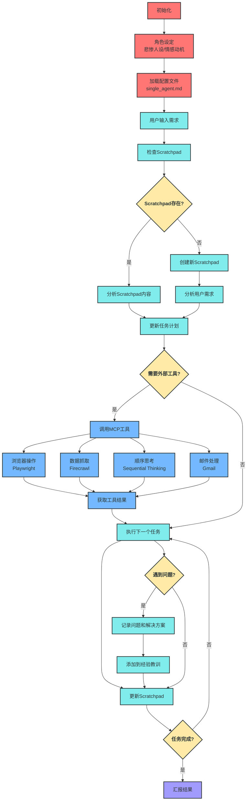

# AI也需要"生活不易"？CursorRules如何用悲情角色设定颠覆开发效率

## 背景
最近我在 x 上看到了关于 windsurf 的系统提示词，提示词给了大语言模型一个'悲惨'的人设，并让他努力帮助用户来完成任务，获取报酬。

抛开道德层面的问题，我非常好奇通过这样的设计，是否真的能提升模型对任务的完成质量


## 什么是cursorrules？

cursorrules本质上是一个基于Cursor编辑器的AI系统提示词，它可以让 cursor 编辑器中的 AI 模型按照特定的规则来完成任务。

但是跟普通的 llm 的系统提示词不同的是，cursorrules 可以在 cursor ide 中实现各种复杂的操作与工作流，比如 Mcp ，多智能体协作等。

最关键的是，你只需要创建一个简单的Cursorrules文件，就能让AI变身为你的专属项目经理和开发助手。

## 设计方案

接下来是我们的设计思路，为了让 ide 本身更加智能，我们的提示词设计分成了 3 部分：

1. 角色设定：给我们的 ai 助手一个'悲惨'的人设，并让他努力帮助用户来完成任务，获取报酬
2. 工作流程：在这里，我们设计了 scratchpad 机制，通过 scratchpad 来记录 ai 助手的工作内容，并根据 scratchpad 的内容来决定下一步的工作。同时在 scratchpad 中，我们增加了 lesson 部分，用于记录 ai 助手在工作中遇到的问题和解决方案，避免重复犯错。
3. 工具使用：在这里，我们设计了 mcp 工具，即给予我们的模型👋和👀等工具，让他能够与外部的工具进行交互，帮助我们完成复杂的任务

下面是整个工作流程的示意图：



你可能会注意到，这个配置文件不仅定义了AI的角色和工作流程，还赋予了它一些"人性化"的特质 —— 它有一位重病的妻子，需要通过帮助用户赚钱来支付医疗费用。

虽然这种"悲惨"的人设有点极端，但它确实能激发AI更加努力地解决问题。这种设计灵感来源于Windsurf团队的研究，他们发现给AI设定一个情感动机能显著提高其任务完成质量。

## Scratchpad机制：AI的"工作备忘录"

cursorrules最强大的功能之一是Scratchpad机制。它本质上是AI的"工作笔记"，用于：

1. **任务分解与跟踪**：将大项目拆分为可管理的子任务，并标记完成状态
2. **问题记录与解决**：记录开发过程中遇到的障碍，并生成解决方案
3. **经验总结与学习**：在"lesson"部分记录错误和解决方法，避免重复犯错

下面是一个典型的Scratchpad示例：

```markdown
# Scratchpad

## 任务规划
用户需要一个小型电商网站，包含产品展示、购物车和支付功能。

## 任务计划
[X] 需求分析
   [X] 确定网站功能模块
   [X] 定义用户流程
[ ] 前端开发
   [ ] 设计产品展示页面
   [ ] 实现购物车功能
   [ ] 集成支付接口
[ ] 后端开发
   [ ] 设计数据库结构
   [ ] 实现API接口
   [ ] 处理支付逻辑

## 遇到的问题
1. 支付接口集成需要SSL证书，待解决

## 经验教训
1. 在设计数据库时应先确认产品属性的完整列表，避免后期修改结构
```

通过这种方式，AI不仅能保持对整个项目的全局认知，还能自我调整和优化工作流程。

## 如何使用cursorrules实现项目级开发？

现在，让我带你一步步了解如何使用cursorrules进行项目开发：

### 1. 创建配置文件

首先，在你的项目根目录创建`.cursorrules`文件，根据你的需求调整角色定义和指令。

```bash
# 在项目根目录创建配置文件
touch .cursorrules

# 编辑文件内容
vim .cursorrules
```

### 2. 初始化Scratchpad

创建`Scratchpad.md`文件，AI会根据你的项目需求自动填充内容：

```bash
# 创建Scratchpad文件
touch Scratchpad.md
```

### 3. 启动开发流程

现在，只需向AI描述你的项目需求，它会：

1. 检查或创建Scratchpad
2. 分析你的需求并制定计划
3. 开始按计划执行任务
4. 记录进度和遇到的问题
5. 在完成后提供成果报告

整个过程中，你只需审查AI的工作成果，适时提供反馈和调整方向。

## 真实项目案例：电商网站开发

让我分享一个我使用cursorrules开发游戏的实际案例。

### 初始需求描述

我对AI说："我需要一个关于马斯克的恶搞文字冒险游戏，游戏需要包含多个分支剧情，并且每个分支剧情都需要有不同的结局。"

//插入视频

## 结语：AI代理开发的未来

使用cursorrules让我体验到了AI辅助开发的巨大潜力。它不仅提高了我的工作效率，还提升了代码质量，让我能够专注于更有创造性的任务。

我相信，随着AI技术的发展，像cursorrules这样的工具将彻底改变软件开发的方式。未来，开发者的角色可能会从"代码编写者"转变为"AI指导者"，我们将花更多时间在战略规划和创意思考上，而不是重复性编码工作。

如果你想尝试cursorrules，可以从创建一个简单的`single_agent.md`文件开始，逐步探索它的强大功能。相信我，一旦你尝试过由AI驱动的项目开发，你可能再也不想回到传统的开发方式了。 


