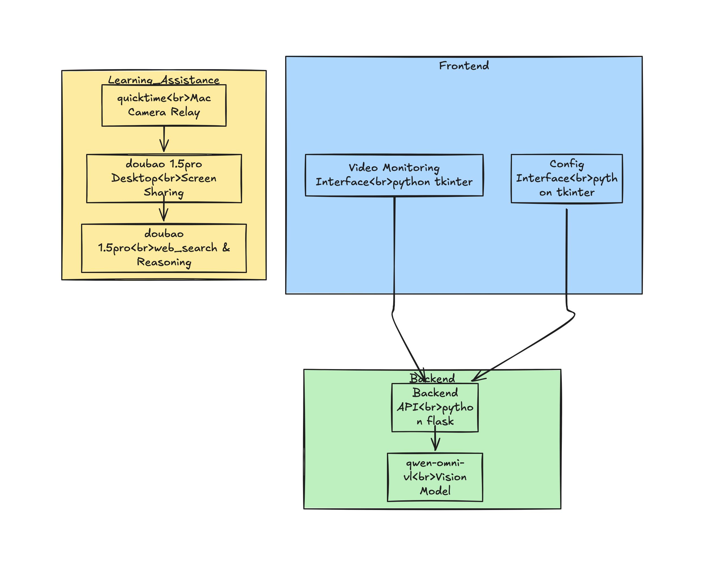
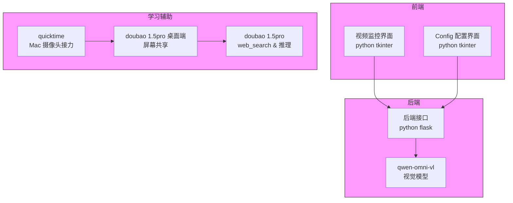
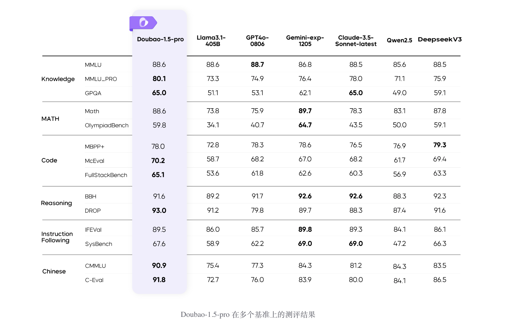
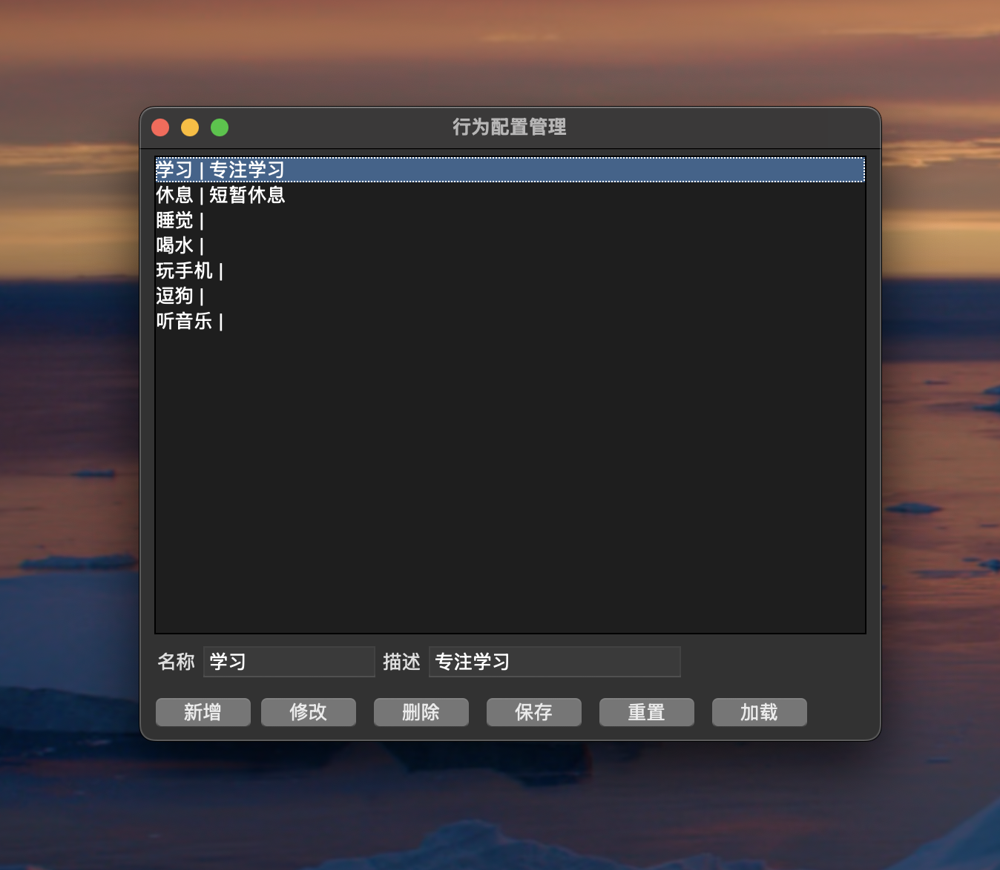
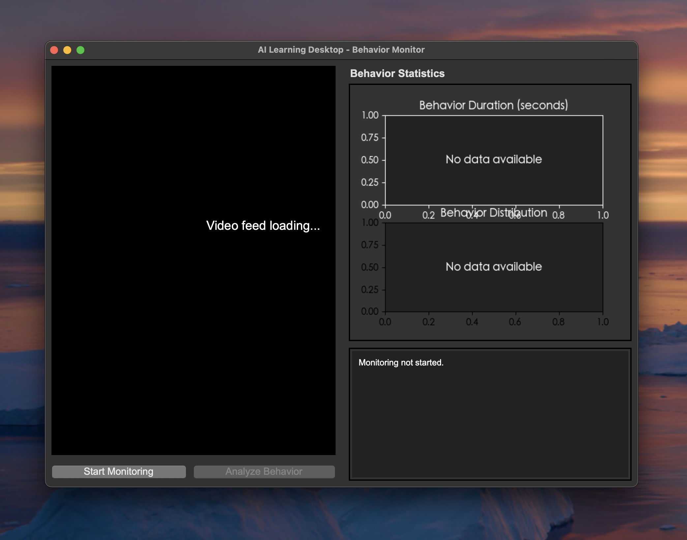
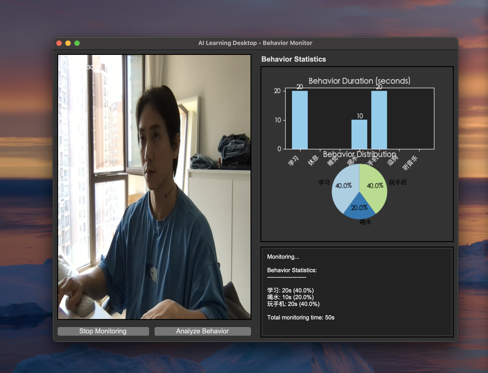
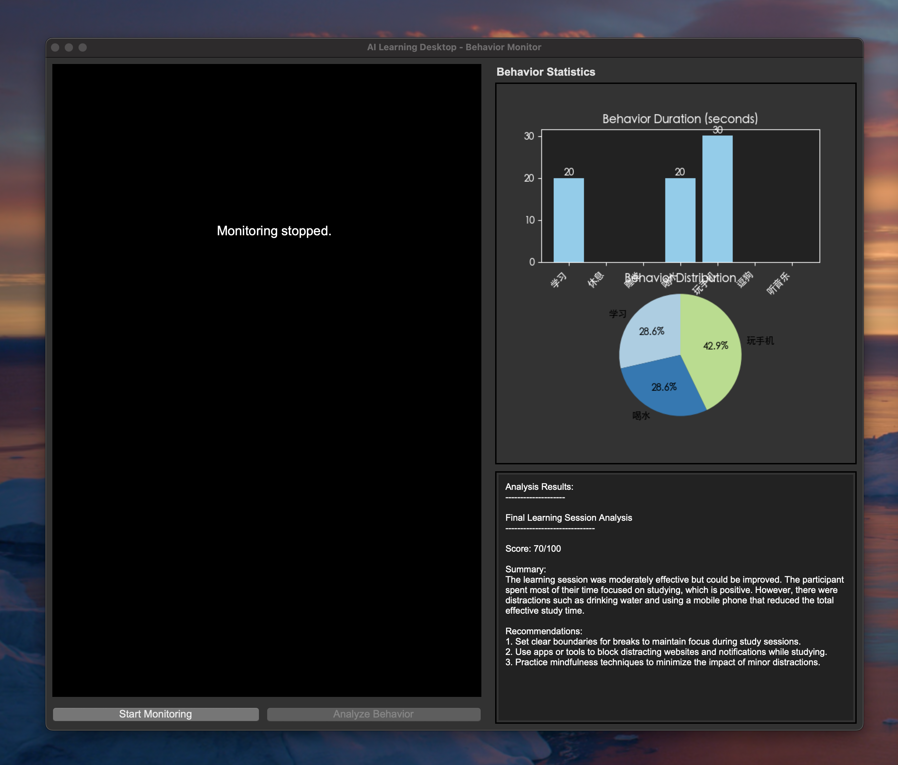

# ai_study_desk

##  背景
最近在拜访朋友时，我见到了他们辅导孩子完成家庭作业的场景。朋友需要全程陪伴孩子做作业，随时解答问题，耐心细致地引导，最后还要批改作业。

整个过程持续了将近两个小时，直到结束我们才有时间坐下来。这让我意识到，如今辅导孩子做作业是一件非常辛苦的事情。朋友还告诉我，现在的学校和我们当年已经大不相同：
- 作业量大：现在的小学布置的作业量远超以往，以前我们可能在学校就能完成作业，而现在几乎不可能，回家后还需要花2-3小时才能完成小学的作业。
- 难度高：目前小学作业的难度大幅提升，有些题目连家长都难以解答，需要查阅资料或上网搜索。
- 家长全程参与：此外，现在作业的批改主要依赖家长完成，而不是老师。老师布置的回家作业不会单独批改，家长负责批改，老师只负责记录作业情况。

在这个过程中，我发现了两个核心问题：
- 难：作业难度提升，即使家长也常常需要查资料才能完成。
- 累：除了作业本身的难度，整个过程非常耗时耗力。家长在一天工作后，还要再花2-3小时辅导孩子写作业，实在让人力不从心。

于是我开始思考，是否可以通过一套智能化方案，帮助朋友和孩子解决家庭作业辅导的问题。这个方案需要满足以下要求：
- 自动回答：可以自动响应并回答小孩的问题，辅助其完成作业
- 自动记录：自动记录整个学习过程，并给出最后的学习报告
- 不需要购买设备：不需要额外购买其他硬件设备，只需要一个电脑和手机即可

## 方案设计
基于以上需求，我开始着手具体的方案设计与选型。

### 流程设计

方案说明：
- 前端：通过 python tkinter 实现，包含视频监控界面和配置界面
- 后端：通过 python flask 实现，包含后端接口和与 qwen-omni-vl 的交互。这里选择qwen 作为监控模型的原因是其高性能和低成本。
- 学习辅助：通过 quicktime 和 doubao 1.5pro 实现，包含视频监控和屏幕共享。豆包是字节最新发布的多模态模型，在多项基准测试中均表现出色。
- 

##  功能测试
在完成相关功能开发后，我们对其进行了实际测试：

### 配置功能

在配置界面，可以通过配置实现监控点行为的动态自定义。其本质是通过动态提示词，将监控点配置信息传递给qwen-omni-vl，让其对指定行为进行监控，并返回识别到的视频行为及持续时长。支持的操作包括：
- 新增
- 修改
- 删除
- 保存
- 重置
- 加载：允许我们动态的调整，而不需要每次重启应用

### 监控功能
监控界面整体分为三个区域：
- 视频输入区域：用于展示监控画面。每隔10秒会将过去的视频内容发送给qwen-omni-vl进行识别，识别结果会展示在识别结果区域。由于每秒只采集1帧，对视频内容的消耗并不高。

- 识别结果区域：展示qwen-omni-vl的识别结果。我们会解析识别内容，并统计各类行为在过程中的出现时长。最终以图表形式展示，让整个学习过程一目了然。

- 学习总结区域：每次学习结束后，模型会对整个过程进行总结和评分，并一键生成学习总结报告。
- 
### 学习辅助
在学习辅助的界面，我们主要实现的是：
- 学习监控：学习内容画面监控，与‘监控’功能不同，这里我们调用的是手机的摄像头，来捕捉在桌面端的内容，由于目前小学阶段的作业都是在课本上完成，而不是在电脑端，我们需要让大模型能够看到我们学习的内容
- 实时语音交互：用户在学习的过程中可以随时发起提问请求，模型会分析看到的img，并且调用doubao 1.5pro 给出分析的结果

##  项目总结
于是我们实现整个学习过程的自动化，无需家长介入，就能完成 80% 的作业辅导的内容。

当然，这里还有剩下的 20%，包含了，作业的修改，记录。
我也考虑了后续的优化方案，
- 修改功能：需要使用文生图的能力，在通过提示词+img 的情况下，返回作业修稿后的内容进行呈现
- 作业的记录：需要使用模型的mcp，链接 notion 或者google doc等外部文档存储产品，在整个学习过程完成后，实现全部内容的自动上传与分类。

当前以上的两个功能并没有在视频中完整的实现，在后续的优化中，我将实现这两个功能。

thx for watching

