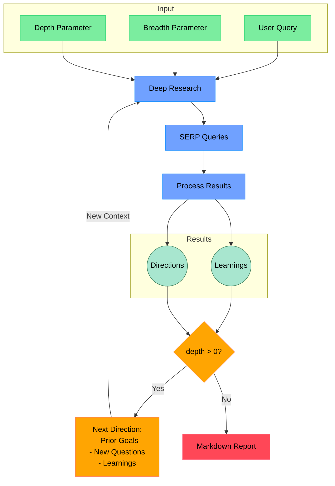

# 省下200美元！深度研究助手 deep-research 开源方案详解

## 从一个生活小问题说起

"儿子，你帮我查查生酮饮食到底怎么样？我听说这个可以帮助减肥"

这是最近妈妈问我的一个问题。作为程序员，帮家人查资料已经是家常便饭了。但这次我遇到了困难 —— 网上关于生酮饮食的信息实在太多太杂：

- 有说能快速减重的
- 有说可能会伤肾的
- 还有说要因人而异的...

不同的"专家"有不同观点，营销号和科普文章混在一起，连研究结果都互相矛盾。作为负责任的儿子，我需要一个更可靠的研究方法。

就在这时，我想起了 OpenAI 新推出的 Deep Research 功能。它能自动搜索整理资料，分析观点可靠性，最后生成详细的研究报告。但一看价格...每月 200 美元！就为了偶尔查查资料，实在太贵了。

## 遇见 deep-research：开源的深度研究助手

然后我在 GitHub 上发现了 deep-research 这个开源项目。它通过结合搜索引擎、网页抓取和大语言模型，实现了类似的功能。最吸引我的是：

- 完全开源，代码简洁
- 只需支付基本的 API 调用费用
- 可以自由定制和扩展

how it works
```
// Start Generation Here


正如流程图里所展示的，首先，你提供一个研究问题，然后设置研究范围和深度。在我查看了项目的代码后，我发现这里的范围和深度，其实本质上控制的是：

范围：在你输入query以后，会生成多少个类似的query，然后去进行搜索。
深度：在完成一次搜索后，还是否需要根据上一轮的搜索结果，生成新的query，然后去进行搜索。

所以当整个loop结束以后，他会总结之前所有的结果包括在最开始生成的goal，然后生成一个最终的markdown报告。

然后接下来，就让我们上手测试一下他真实的运行效果。

## 快速上手 deep-research

要开始使用 deep-research，你需要：

1. **准备环境**：
   - 安装 Node.js
   - 获取必要的 API Keys（Firecrawl 和 OpenAI）

2. **安装项目**：
```bash
git clone https://github.com/dzhng/deep-research
cd deep-research
npm install
```

3. **配置密钥**：
创建 `.env.local` 文件并添加你的 API Keys：
```env
FIRECRAWL_KEY="your_key"
OPENAI_KEY="your_key"
```
在我的测试里，我使用的是openai 的模型


4. **其他问题**
如果你是来自中国的用户，你可能会遇到一些问题。你会发现通过npm start 启动项目后，会报错。错误会一直显示你请求openai的api失败。
这是因为openai的api在国内访问不了。
解决办法是，使用代理。
然后你需要在你的.env中修改你全局的代理至
HTTPS_PROXY="http://127.0.0.1:7890"
HTTP_PROXY="http://127.0.0.1:7890"
然后再将你的provider设置为openai-proxy
我通过这样的方式解决了这个问题。

然后接下来我们可以来测试一下deep-research的实际效果。

```bash
npm start
```

输入问题："生酮饮食的科学依据和潜在风险是什么？"
设置研究深度：3（这样能深入挖掘）
设置研究广度：4（确保覆盖足够的信息源）

就像我在之前提到的，这里的深度和广度的说明，可以更加方便你理解这里参数的含义。

然后根据系统的运行，会和deep research一样先生成一些和主题相关的query，需要你来回答

然后你可以按照系统的要求，回答这些问题。

接下来系统就会根据你的输入用firecrawl和openai来生成最终的报告。


## prompt 实现
我在这里查阅了deep-research的源码，发现他其实是一个prompt工程的实现。但是他的提示词非常有参考价值，因此我把里面的内容分享出来：


```
// 1. 初始问题明确阶段
// 这个prompt用于在用户输入初始问题后,通过追问来明确研究方向
<more_info>
Given the following query from the user, ask some follow up questions to clarify the research direction. Return a maximum of 4 questions, but feel free to return less if the original query is clear: <query>${query}</query>`,

// 2. 搜索查询生成阶段
// 根据用户问题生成搜索引擎查询语句,确保查询语句互不重复
<first_serp>
Given the following prompt from the user, generate a list of SERP queries to research the topic. Return a maximum of 4 queries, but feel free to return less if the original prompt is clear. Make sure each query is unique and not similar to each other

// 3. 研究目标和方向规划阶段
// 明确研究目标,并规划后续深入研究的方向
<desc_goal&direction>
First talk about the goal of the research that this query is meant to accomplish, then go deeper into how to advance the research once the results are found, mention additional research directions. Be as specific as possible, especially for additional research directions.

// 4. 搜索结果学习提取阶段
// 从搜索结果中提取关键信息和学习要点
<gen_learnings>
Given the following contents from a SERP search for the query <query>${query}</query>, generate a list of learnings from the contents. Return a maximum of ${numLearnings} learnings, but feel free to return less if the contents are clear. Make sure each learning is unique and not similar to each other. The learnings should be concise and to the point, as detailed and information dense as possible. Make sure to include any entities like people, places, companies, products, things, etc in the learnings, as well as any exact metrics, numbers, or dates. The learnings will be used to research the topic further.\n\n<contents>${contents
      .map(content => `<content>\n${content}\n</content>

// 5. 后续问题生成阶段
// 根据已有发现生成后续研究问题
<follow-up questions>
List of follow-up questions to research the topic further, max of ${numFollowUpQuestions}

// 6. 深入研究阶段
// 基于前期学习成果生成更具体的查询
<follow_up>
Here are some learnings from previous research, use them to generate more specific queries

// 7. 最终报告生成阶段
// 整合所有研究发现,生成详细的研究报告
<report>
Given the following prompt from the user, write a final report on the topic using the learnings from research. Make it as as detailed as possible, aim for 3 or more pages, include ALL the learnings from research:\n\n<prompt>${prompt}</prompt>\n\nHere are all the learnings from previous research:\n\n<learnings>\n${learningsString}\n</learnings>`,


```

## 总结
通过对deep-research项目的深入分析,我们可以看到这是一个精心设计的prompt工程实现。它通过7个关键阶段,构建了一个完整的研究流程:

1. 问题明确阶段 - 通过追问帮助用户明确研究方向,避免研究偏离主题
2. 搜索查询生成 - 将研究问题转化为有效的搜索语句,确保查询覆盖全面且不重复
3. 目标和方向规划 - 明确研究目标并提前规划深入研究路径
4. 学习要点提取 - 从搜索结果中提取关键信息,重点关注实体、数据等具体内容
5. 后续问题生成 - 基于已有发现生成新的研究问题,推动研究深入
6. 深入研究阶段 - 利用前期积累生成更有针对性的查询
7. 报告生成阶段 - 系统整合所有研究发现,形成详实的研究报告

这是一个设计非常巧妙的prompt工程实现。不过当然项目本身最大的问题在于在中国你会遇到很多限制，不过好在不用每月200美金的使用成本，我在后续通过一个别的项目 https://github.com/assafelovic/gpt-researcher 中，通过ui化方式，更好的实现了这个项目，我会在下一期的内容中一起来分享两个openai的核心功能 operater 和 deepresearch的平替版本。

---

# Save $200! A Deep Dive into deep-research: An Open Source Alternative to OpenAI's Deep Research

## idea

"Son, can you help me research the keto diet? I heard it's good for weight loss."

As a programmer, helping family with research is a common occurrence. But this time, I faced a challenge — there was just too much conflicting information about the keto diet online:

- Some say it's great for quick weight loss
- Others warn about kidney damage
- Many suggest it depends on the individual...

With different "experts" offering contradicting views and marketing content mixed with scientific articles, even research results seemed to conflict. As a responsible son, I needed a more reliable research method.

That's when I remembered OpenAI's newly launched Deep Research feature. It can automatically search and organize materials, analyze the credibility of different viewpoints, and generate detailed research reports. But the price... $200 per month! That's too expensive just for occasional research needs.

## Discovering deep-research: An Open Source Research Assistant

Then I found the deep-research project on GitHub. It combines search engines, web scraping, and large language models to achieve similar functionality. What attracted me most was:

- Completely open source with clean code
- Only basic API call costs
- Freely customizable and extensible

## How It Works

[Same flowchart as above]

As shown in the flowchart, you first provide a research question and set the research breadth and depth parameters. After examining the code, I found that these parameters essentially control:

Breadth: How many similar queries will be generated after your input query for searching.
Depth: Whether to generate new queries based on previous search results for further research.

When the entire loop ends, it summarizes all results, including the initially generated goals, and produces a final markdown report.

## Quick Start Guide

To start using deep-research, you need:

1. **Environment Setup**:
   - Install Node.js
   - Get necessary API Keys (Firecrawl and OpenAI)

2. **Project Installation**:
```bash
git clone https://github.com/dzhng/deep-research
cd deep-research
npm install
```

3. **Configure API Keys**:
Create a `.env.local` file and add your API Keys:
```env
FIRECRAWL_KEY="your_key"
OPENAI_KEY="your_key"
```

4. **Special Note for Users in China**
If you're in China, you might encounter issues accessing OpenAI's API. The solution is to use a proxy:
```env
HTTPS_PROXY="http://127.0.0.1:7890"
HTTP_PROXY="http://127.0.0.1:7890"
```
Also, set your provider to "openai-proxy".

Let's test it with our keto diet example:
```bash
npm start
```

Input: "What are the scientific basis and potential risks of the keto diet?"
Depth: 3 (for deep analysis)
Breadth: 4 (for comprehensive coverage)

## Prompt Engineering Implementation

Looking into the source code, I found that deep-research is essentially a prompt engineering implementation. Here are the valuable prompts used:

<more_info>
Given the following query from the user, ask some follow up questions to clarify the research direction. Return a maximum of 4 questions, but feel free to return less if the original query is clear: <query>${query}</query>

<first_serp>
Given the following prompt from the user, generate a list of SERP queries to research the topic. Return a maximum of 4 queries, but feel free to return less if the original prompt is clear. Make sure each query is unique and not similar to each other.

<desc_goal&direction>
First talk about the goal of the research that this query is meant to accomplish, then go deeper into how to advance the research once the results are found, mention additional research directions. Be as specific as possible, especially for additional research directions.

<gen_learnings>
Given the following contents from a SERP search for the query <query>${query}</query>, generate a list of learnings from the contents. Return a maximum of ${numLearnings} learnings, but feel free to return less if the contents are clear. Make sure each learning is unique and not similar to each other. The learnings should be concise and to the point, as detailed and information dense as possible. Make sure to include any entities like people, places, companies, products, things, etc in the learnings, as well as any exact metrics, numbers, or dates. The learnings will be used to research the topic further.
<contents>${contents.map(content => `<content>\n${content}\n</content>`)}</contents>

<follow-up questions>
List of follow-up questions to research the topic further, max of ${numFollowUpQuestions}

<follow_up>
Here are some learnings from previous research, use them to generate more specific queries

<report>
Given the following prompt from the user, write a final report on the topic using the learnings from research. Make it as as detailed as possible, aim for 3 or more pages, include ALL the learnings from research:

<prompt>${prompt}</prompt>

Here are all the learnings from previous research:
<learnings>
${learningsString}
</learnings>

## Summary

Through deep analysis of the deep-research project, we can see it's an elegantly designed prompt engineering implementation. It builds a complete research workflow through 7 key stages:

1. Question Clarification - Help users clarify research direction through follow-up questions
2. Search Query Generation - Transform research questions into effective search queries
3. Goal and Direction Planning - Define research goals and plan deeper research paths
4. Key Points Extraction - Extract critical information from search results
5. Follow-up Question Generation - Generate new research questions based on findings
6. Deep Research Phase - Generate more targeted queries based on initial findings
7. Report Generation Phase - Integrate all research findings into a detailed report

While this project faces some limitations in China, it provides a great alternative to the $200/month OpenAI feature. I've found an even better implementation with a UI approach in another project: https://github.com/assafelovic/gpt-researcher. I'll share more about both OpenAI's operator and deep research alternatives in my next article.

