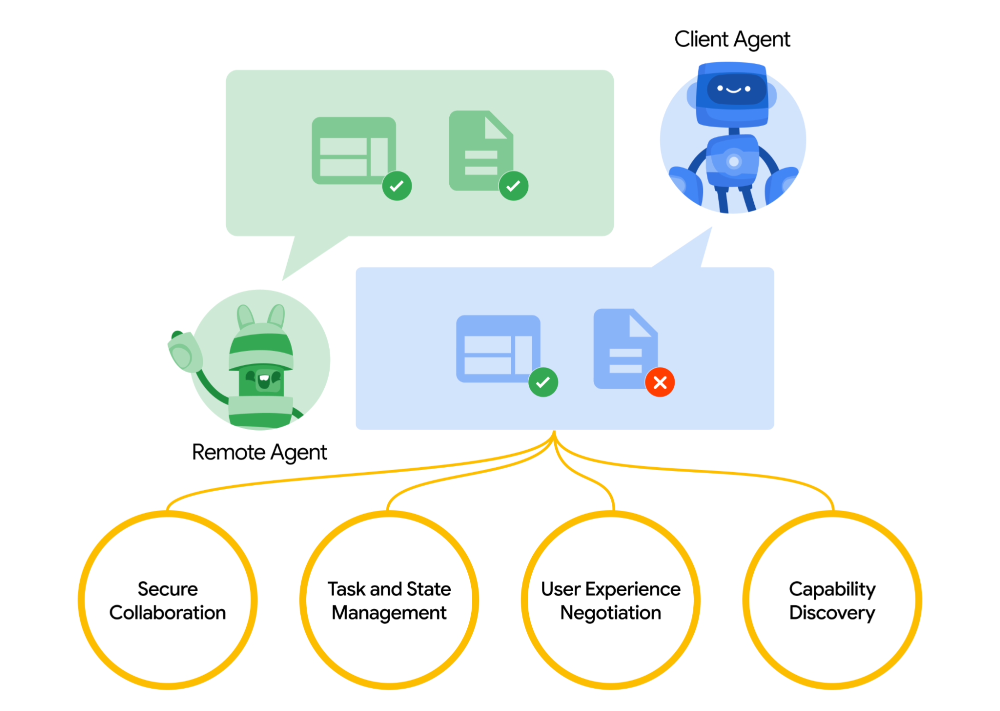
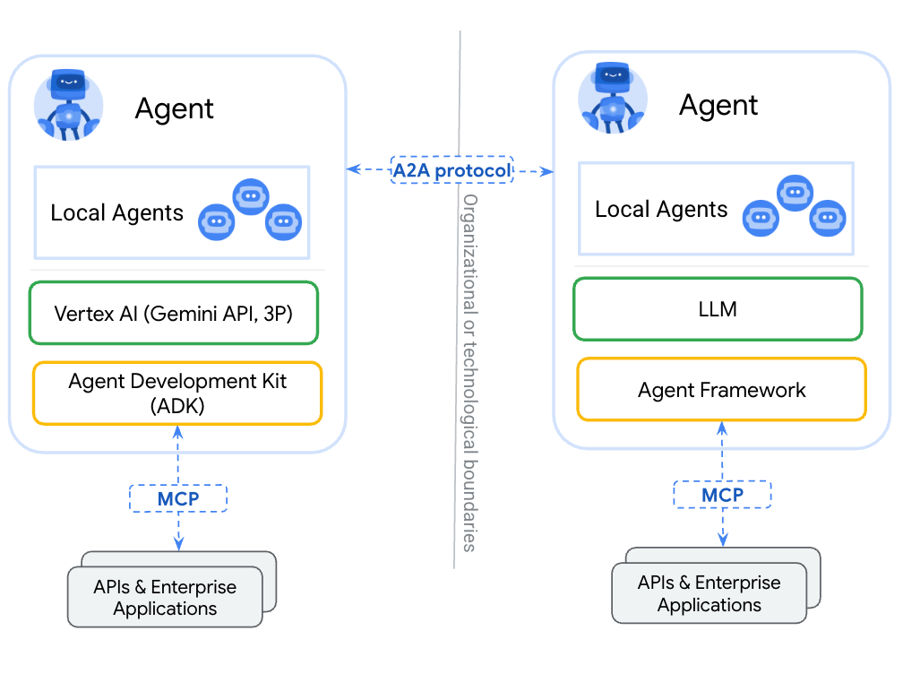
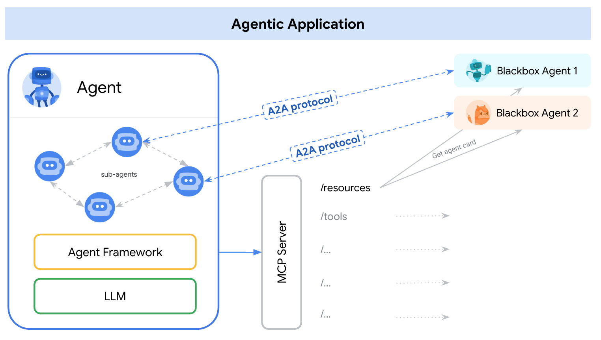

# Google A2A is insane! intro for google a2a portal

## 介绍
 google 4.11 日在 youtube 上直播了《Google Cloud Next 25 Developer Keynote: You can just build things》
https://www.youtube.com/watch?v=xLDSuXD8Mls
内容包含了：
- Gemini Models in AI Studio
- From Prompt to Agent Demo
- Build Multi-agent systems
- MLB Hackathon 
- Software Agents
- MLB Hackathon

在过程中发布了包括 vertex ai , agent development kit, firebase studio，veo2等多个工具。
但是，最引起我注意的还是 A2A 协议。

Agent-to-Agent (A2A) 协议，这是一个开放的协议，旨在实现 AI 代理之间的互操作性和协作。A2A 协议允许不同供应商或框架构建的 AI 代理能够相互通信、安全地交换信息并协调行动，无论它们的底层技术如何。

这就很容易让我们想起去年 anthropic 发布的也是最近爆火的 MCP 协议，MCP 协议是 Anthropic 为 AI 代理之间提供一致的接口而设计的。MCP 协议允许 AI 代理之间进行通信，以实现协作和任务分配。MCP 协议的目标是为 AI 代理提供一个统一的接口，以促进它们之间的互操作性和协作。而且目前已经有了很多的大型的互联网公司公开了 MCP 协议的实现，比如 figma，高德地图，等

那么，A2A 和 MCP 之间有什么区别？他们又有着什么样的联系？我们可以用它来实现什么？接下来就来详细说明。

## A real-world example: candidate sourcing
在开始复杂的说明前，我们先来看一个实际的例子：
https://storage.googleapis.com/gweb-developer-goog-blog-assets/original_videos/A2A_demo_v4.mp4
Hiring a software engineer can be significantly simplified with A2A collaboration. Within a unified interface like Agentspace, a user (e.g., a hiring manager) can task their agent to find candidates matching a job listing, location, and skill set. The agent then interacts with other specialized agents to source potential candidates. The user receives these suggestions and can then direct their agent to schedule further interviews, streamlining the candidate sourcing process. After the interview process completes, another agent can be engaged to facilitate background checks. This is just one example of how AI agents need to collaborate across systems to source a qualified job candidate.

### A2A 如何工作
上面的示例，就采用了 a2a 协议，实现了多个 agent 之间的协作。那接下来我们来看下这是如何实现的

A2A 促进了"客户端"代理和"远程"代理之间的通信。客户端代理负责制定和传达任务，而远程代理负责执行这些任务。这种交互涉及几个关键功能：

- **能力发现**：代理可以使用 JSON 格式的"代理卡"来宣传其能力，使客户端代理能够识别最适合执行任务的代理。

- **任务管理**：客户端和远程代理之间的通信以任务完成为导向，代理共同努力满足最终用户的请求。

- **协作**：代理可以相互发送消息以传达上下文、回复、工件或用户指令。

- **用户体验协商**：每条消息都包含"部分"，这是一个完整形成的内容片段，如生成的图像。每个部分都有指定的内容类型。

### A2A 和 mcp 之间有什么区别？
为了更好得理解 A2A 和 MCP 之间的关系，我们来用大型交响乐团演奏这个场景详细说明 A2A 和 MCP 之间的关系：
场景设定：
想象一下，一个能容纳上千观众的宏伟音乐厅里，一支由近百名技艺精湛的音乐家组成的交响乐团正准备演奏贝多芬的《命运交响曲》。听众期待着一场震撼心灵、完美和谐的演出。而你正是站在乐手们中间的指挥家，正在指挥乐团演奏。
1. A2A 你手中的指挥棒
2. MCP 是你台上演奏者的乐谱和乐器
- 标准化的指挥棒，乐器和乐谱（确保你的“输出”能和别人兼容——物理/接口协议）。

简单说：
你（乐手 Agent）需要**乐谱/乐器（MCP 的一部分 - 指令）**告诉你他能演奏具体的音乐。
而你需要协调各个乐手，让他们按照乐谱演奏，最终演奏出美妙的音乐你们之间产生的互动的方式就是指挥棒（A2A）。

MCP (Model Context Protocol) for tools and resources
Connect agents to tools, APIs, and resources with structured inputs/outputs.
Google ADK supports MCP tools. Enabling wide range of MCP servers to be used with agents.
A2A (Agent2Agent Protocol) for agent-agent collaboration
Dynamic, multimodal communication between different agents without sharing memory, resources, and tools
Open standard driven by community.
Samples available using Google ADK, LangGraph, Crew.AI

### why a2a

为什么在有了 mcp 协议的情况下，我们还需要 a2a 协议？

 我们先看下mcp的限制：
 1. mcp 的数量限制，在一个agent中，能够承载的 mcp 数量是有限的，以cursor 为例，他的mcp 上限是 40 个左右，这就意味着你不能无限制得增加mcp 在一个agent中
 2. 上下文处理能力限制，我们都知道，在一些长周期的任务中，比如coding，下，一个单chat 的表现能力会随着上下文的增加而降低，尤其是在处理debug 中，模型会丢失注意力，忘记我们之前给过的指示，变得有点‘痴呆’
 3. 长任务追踪限制，在目前的mcp 下他的能力, 例如长时间处理任务，我们在招聘，处理客服任务时，往往需要等待几小时，甚至几天的时间，我们无法直接获得我们的结果。
 4. 页面呈现限制，我们在自己agent 的展示渲染需要在本地，我们不能通过 嵌入式的方式来获取端侧的结果，表现力有限

正是有上面的问题和限制，a2a 协议应运而生，他 能够有效的解决上面的问题，从而实现正如开头所述的方案，而接下来，我们会尝试自己来搭建一个客服agent，来实现一个完整的客服流程.

 关注我的频道，我会在下期的分享中介绍目前各个大厂的客服系统的设计方案，看下目前他们的客服agent 系统如何解决复杂的长流程的消费者投诉任务

 ### A2A 的核心设计原则
最后我们看下A2A的 5 个核心设计原则

1. **拥抱代理能力**：A2A 专注于使代理能够以自然、非结构化的方式协作，即使它们不共享记忆、工具和上下文。

2. **基于现有标准构建**：该协议建立在现有流行标准之上，包括 HTTP、SSE、JSON-RPC，这意味着它更容易与企业已经日常使用的 IT 堆栈集成。

3. **默认安全**：A2A 设计为支持企业级身份验证和授权，在发布时与 OpenAPI 的身份验证方案保持一致。

4. **支持长时间运行的任务**：A2A 设计灵活，支持从快速任务到可能需要数小时甚至数天的深入研究的场景。

5. **模态不可知**：A2A 支持各种模态，包括音频和视频流，不仅限于文本。

### 总结
A2A 协议提供了一个开放的标准来实现代理之间的协作，从而提高了代理的能力和灵活性。A2A 协议的出现可以说是 MCP 协议的进化版，能够更好地满足代理之间的协作需求。

