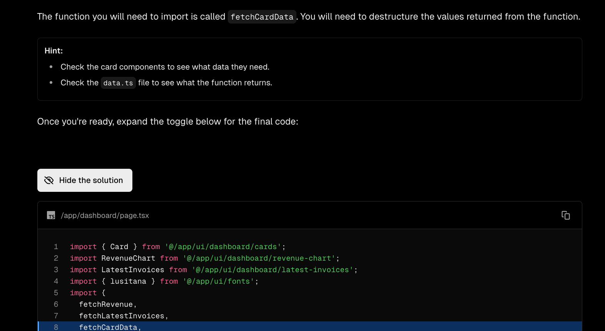

# learn next.js in 5 days(without experience)

## 为什么要在 2025 年学习 Next.js
作为一个没有任何开发经验的初学者，我为什么要学习 Next.js？
1. 它是 React 生态系统中增长最快的框架之一
2. 生态系统成熟，文档齐全，社区活跃
3. 无需单独部署前端和后端，使用同一个项目就可以完成前后端开发。
4. 最重要的是 有了 cursor 以及其他的 AI 工具，学习代码变得非常容易，这在过去是不可想象的。在过去工作的 10 年内，我也尝试过学习过编程，但是学习代码的难度让我望而却步。
5. 因此随着编程的门槛的降低，更多的人可以通过自己去实现自己的想法，这将会是一件非常有意思的事情。

## 什么是 Next.js


## 学习路径
这次我通过 cursor 和 augment 两个 ai工具来辅助学习。
接下来我会解释为什么选择这两个工具，以及他们在过程中具体如何帮助我们完成学习计划

- 学习资料我选择了 Next.js 的官方学习文档，https://nextjs.org/learn
- 官方提供了一系列 next.js的入门课程，同时包括了React Foundations。
- 我由于没有过去的开发经验，所以选择从 React Foundations 和 App Router 开始学习。

- 在项目中，我们在完成基础了 react 的入门之后，开始学习 next.js 的 App Router ，在这个课程中我们会搭建一个full-stack web application.
- 项目包含了
  - A public home page.
  - A login page.
  - Dashboard pages that are protected by authentication.
  - The ability for users to add, edit, and delete invoices.
- 这些是我们在日常的web 应用中最常见的功能，因此我们选择这个项目来学习。

## 学习过程
在学习过程中，我选择了 cursor工具作为我的 ai 助手，他拥有强大的代码补全功能，可以让我们在编写代码的过程中更加高效。

- next.js 的官方文档中，提供了大量的示例代码，我们可以直接在 cursor 中运行这些代码，并查看运行结果


  
- 过程中，我尽量避免使用 cursor 的agent功能，因为这会让我失去很多思考的机会，我更倾向于使用 cursor 的代码补全功能，这样可以帮助我更好的理解代码。
- 但是在过程中，我依然遇到了许多的问题，比如官方文档的示例中经常会省略大量的代码，导致对于一些初学者而言非常头疼，无法理解。
- 因此在这个时候，我会使用 cursor 中的 agent 功能，让 cursor 帮我修复问题，并解释代码。
- 例如在官方课程的Chapter 6 Setting Up Your Database 中，我们遇到在 vercel部署过程中 bcrypt 的错误，这个时候我会选择使用 cursor 的 agent 功能，让 cursor 帮我修复问题，并解释代码。
- 同样Chapter 7 Fetching Data 的课程中有一个作业的部分需要我们去在 card 组件中实现数据的获取的功能，但是在官方的课程中，只有 page.tsx 的代码，并没有包含 card 组件的代码，这个时候我们就可以使用 agent 功能，让 cursor 帮我生成 card 组件的代码。

- 在经历了 5 天的学习后，我终于完成了官方的这两个课程，并成功部署到了 vercel 上。


## 学习总结&分享
- 在完成了官方的这两个课程后，我决定分享我的学习经验，并帮助更多的人去学习 next.js。
因此我个过程中我选择了 augment 工具，https://www.augmentcode.com/


- augment code 是一个 ide 插件，跟 cline 一样是一款代码辅助工具，但是他有一个专门的memery模块，能够更好的处理上下文信息，尤其我们在一个大型项目过程中，反复使用了 cursor 的 agent 助手时候，我在 cursor 中经常会遇到在新开 chat 时候，需要反复去描述遇到的问题，而augment code在这点上明显处理得加优秀


- 我使用 augment 将整个我过去的学习过程直接制作的 html 页面，prompt 如下：
```
Please generate an html page according to the content of @learn-next.js.md. Use HTML + Tailwind CSS to generate the interface and use the lucide icon component library to add icons to the interface. During the process, use highlight, block, flowchart and other style components to make the page more beautiful and easy to read. Store the generated page under the path qiansui_cv/html/learn-next.js.
```

- 最后我获得了一个精美排版的页面，相比在传统的编辑器，比如 notion 或者 obsidian 中，我需要手动去调整排版，在 augment 中，我只需要通过 prompt 就可以获得一个非常精美的页面，这大大提升了我们的效率。

## 分享到社交网络
在有了整个网页的内容后，我需要将内容再分享到社交平台，比如 linkedin 或者 x。
所以我们需要一个更加吸引眼球的封面，这个时候我选择了 chatgpt 的文生图功能，由于 chatgpt 近期的文生图功能的更新，他的图片生成质量已经非常的高了，我只需要通过 prompt 就可以获得一个非常精美的图片来作为我们的封面。

```
Please generate an  youtube video cover image according to the content of @learn-next.js.md. Aspect ratio is 4:3.
```
接下来我们就获得了这样一张封面图片


## 工作流

在这个学习过程中，我建立了一个高效的工作流程：

1. 学习准备
   - 选择 Next.js 官方文档作为主要学习资源
   - 配置开发环境：Cursor IDE 和 Augment 插件
   - 创建学习计划和目标设定

2. 学习执行
   - 跟随官方教程逐步学习
   - 使用 Cursor 的代码补全功能辅助编码
   - 遇到问题时策略性使用 AI 助手：
     - 简单问题：优先自主思考和解决
     - 复杂问题：使用 Cursor Agent 获取帮助
     - 上下文相关：利用 Augment 的记忆功能

3. 知识整理与分享
   - 使用 Markdown 记录学习笔记
   - 通过 Augment 生成精美的 HTML 页面
   - 使用 ChatGPT 生成封面图片
   - 分享到社交平台

## 总结

经过 5 天的 Next.js 学习之旅，我有以下几点重要收获：

1. 技术学习
   - 掌握了 React 基础知识
   - 理解了 Next.js 的核心概念和 App Router
   - 完成了一个全栈 Web 应用的开发和部署

2. 工具使用
   - 发现 AI 工具在学习过程中的重要价值
   - 学会了合理分配 AI 辅助和自主学习的比例
   - 建立了高效的学习-记录-分享工作流

3. 经验总结
   - 对于零基础学习者，选择合适的学习资源至关重要
   - AI 工具能够显著降低学习门槛，但需要避免过度依赖
   - 建立完整的学习-实践-分享闭环有助于巩固知识

4. 未来展望
   - 计划深入学习 Next.js 的更多高级特性
   - 尝试开发更多实际项目来应用所学知识
   - 持续优化 AI 辅助学习的方法论

这次学习经历证明，在 AI 工具的辅助下，即使是零基础的学习者也能够在相对短的时间内掌握现代 Web 开发技术。关键在于选择合适的学习资源、合理使用 AI 工具，并保持学习的专注度和持续性。
