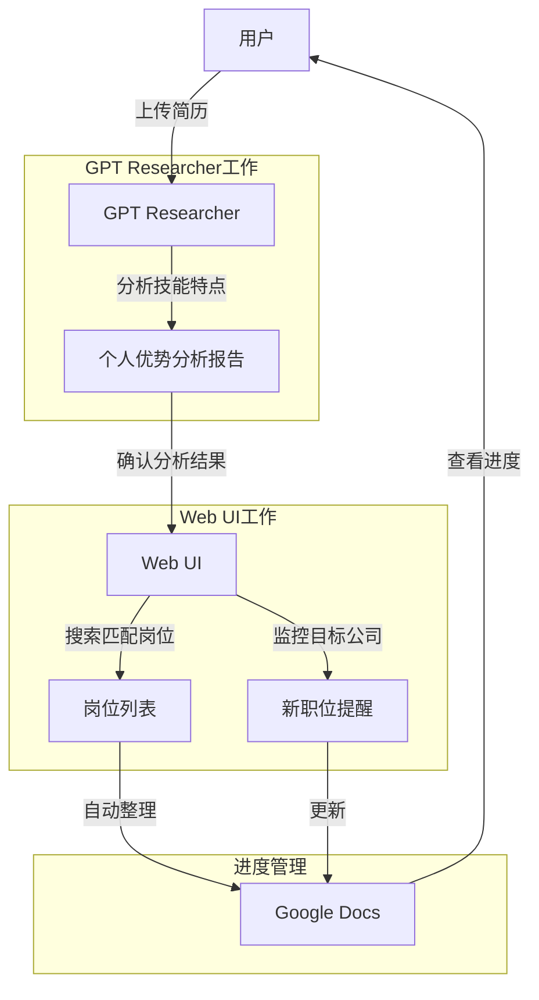
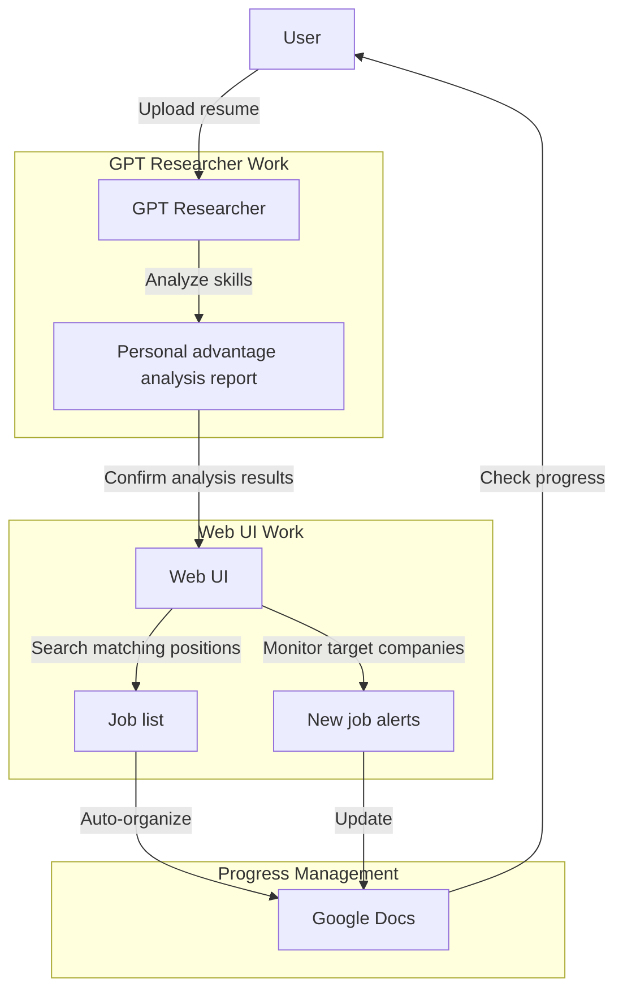

# 求职效率提升300%：两个开源项目搭建个人AI求职助理

## 1. 从一个真实需求说起

最近OpenAI推出了两个备受关注的新功能：

- Deep Research：AI研究助手，能自动搜索资料、分析观点并生成研究报告
- Operator：通过自然语言控制软件，自动完成各种操作任务

这两个功能确实很吸引人，但每月200美元的订阅费着实不便宜。对于个人用户或小团队来说，一年2400美元的支出需要慎重考虑。

好在开源社区总有惊喜。在GitHub上，我发现了两个优秀的替代方案：

- GPT Researcher：一个专注于深度研究的开源工具
- Web UI：一个可视化的自动化操作平台

这两个项目不仅功能相似，而且只需支付基本的API调用费用。更重要的是，它们都是开源的，可以根据实际需求进行定制。

接下来，就让我带大家详细了解这两个强大的开源工具。

## 2. 两个强大的开源项目

### 2.1 GPT Researcher：AI研究助手

GPT Researcher是一个智能研究工具，可以帮你完成各种调研任务。它最大的特点是：

- **全自动信息收集**：输入主题后，自动搜索和整理相关资料
- **智能分析总结**：对比多个信息源，提取关键信息，避免偏见
- **规范报告输出**：自动生成带有引用的研究报告，支持多种格式

比如你想了解"生成式AI的发展趋势"，它能在几分钟内整理出一份包含最新数据、技术动态和专家观点的完整报告。

### 2.2 Web UI：智能操作助手

Web UI则是一个让你用自然语言控制软件的工具，主要优势是：

- **简单易用**：用日常语言就能完成复杂操作
- **自动化处理**：支持批量任务和工作流程自动化
- **高度可定制**：可以根据需求添加新的功能和集成

### 2.3 创意组合应用

让我们用一个真实的求职场景，来看看如何把这两个工具组合使用。假设你正在找工作，手上有一份简历，但不确定该投什么岗位最合适。

#### 智能求职助手

这个工具组合可以帮你实现"精准求职"，不用海投简历也能找到最合适的工作。具体是这么用的：

1. **分析个人优势**（GPT Researcher负责）
   - 上传你的简历，分析你的技能特点
   - 研究市场上最匹配的岗位类型
   - 找出你的优势和可能的发展方向
   - 生成个性化的求职建议报告

2. **智能岗位匹配**（Web UI出马）
   - 根据分析结果，自动搜索匹配度高的职位
   - 监控目标公司的最新招聘信息
   - 自动筛选符合你要求的工作机会
   - 记录投递过的公司，避免重复投递

3. **求职进度管理**（自动同步到Google Docs）
   - 自动创建求职跟踪表格
   - 记录公司信息、岗位要求、投递状态
   - 对比不同岗位的薪资福利
   - 标注面试时间和重要节点

下面这个流程图展示了整个智能求职助手的工作流程：



举个例子：
> 小王是一名有3年经验的前端开发，想找一份更好的工作。他把简历扔给GPT Researcher分析，发现自己在React和微前端方面特别有优势，适合做中大型企业的前端架构工作。Web UI立刻开始在各大招聘网站搜索相关岗位，找到50个匹配的职位，自动整理到Google表格，按照匹配度排序。小王每天打开表格就能看到最新的招聘信息，轻松跟踪投递进度。

这套组合特别适合：
- 不想盲目投简历的求职者
- 想换个发展方向但不确定方向的人
- 对自己优势没有清晰认识的新人
- 想了解自己市场价值的互联网求职者

工具会帮你搞定剩下的事情，让求职变得更有条理，也更有针对性。而且，这种方式比起漫无目的地海投简历，能帮你省下大量时间，还能提高成功率。

## 3. 动手试试看

下面我将手把手演示如何使用这两个工具来实现智能求职助手功能。整个过程包括：分析简历、匹配岗位和进度管理三个步骤。

### 3.1 简历分析与岗位研究

首先，用deepseek-r1模型，在cursor中导入自己的简历信息，生成research主题，如图所示，红色的部分就是我们生成的需要的研究框架。
<插入图片：简历分析与研究框架截图>

接下来我们将内容复制，然后打开gpt-researcher的仓库，根据项目的说明，部署服务与安装。

需要注意点，我们需要准备好OpenAI的key。国内用户可能需要使用代理或者考虑使用其他支持的模型。

```bash
# 克隆仓库
git clone https://github.com/assafelovic/gpt-researcher.git
cd gpt-researcher

# 安装依赖
pip install -r requirements.txt

# 配置环境变量
export OPENAI_API_KEY=你的API密钥
```

然后我们在本地打开页面：

```bash
python main.py 
```

系统会自动打开浏览器访问：http://localhost:8501/
<插入图片：GPT Researcher主页面截图>

接下来我们将我们刚才研究的框架内容粘贴进去，设置研究主题为"基于此简历分析适合的岗位和个人优势"。
<插入图片：粘贴研究框架到GPT Researcher>

然后在这里会有一些自定义的选择：
- type：我选择了DETAIL，大概需要 5 分钟左右
- tone：对于就业形势的描述，为了不受打击，我选择了尽可能乐观的描述
- sources：我选择了 WEB 通过网络来获取信息源。
<插入图片：参数设置截图>

点击"开始研究"后，等待几分钟，GPT Researcher会根据我们的参数来进行搜索，整个过程你可以在你的 终端看到执行的全部流程，在等待 5 分钟后自动完成分析并生成报告。
<插入图片：生成的简历分析报告>
报告的内容非常详细，包括了我的优势、劣势、适合的岗位、以及一些建议。

### 3.2 使用Web UI搜索匹配岗位

有了分析报告，接下来我们使用Web UI来搜索匹配的岗位信息。

首先安装Web UI：
```bash
git clone https://github.com/mckaywrigley/web-ui.git
cd web-ui
npm install
```

配置必要的API密钥：
```
# .env文件
OPENAI_API_KEY=你的API密钥
```

启动Web UI服务：
```bash
npm run dev
```

打开浏览器访问：http://localhost:3000
<插入图片：Web UI主界面>

在Web UI中创建新的搜索任务：
<插入图片：创建搜索任务截图>

过程中你需要注意：
如果为了你的浏览器能够继承你的账号的登录信息，我建议使用自己的浏览器，因此你需要通过别的浏览器，如 firefox,safari 来打开http://localhost:3000 的页面，这样就会通过你自己的 chrome来访问，就可以保留你浏览器的登录信息

我们将GPT Researcher生成的职位关键词和建议输入到搜索框，并设置以下PROMPT：
```
请执行以下任务：
1. 访问SEEK招聘网站
2. 搜索关键词："Canva 产品经理 悉尼"
3. 从搜索结果中选择最匹配的2个职位
4. 对每个职位提取：
   - 公司名称
   - 职位名称
   - 岗位描述
5.打开 Google Docs 表格，创建新表格
6.将信息导出到Google Docs

Please perform the following tasks:
1. Visit the SEEK recruitment website.
2. Search for keywords: "Canva Product Manager Sydney".
3. Select the two most matching positions from the search results.
4. Extract for each position:
   - Company name
   - Position title
   - Job description.
5. Open a Google Docs spreadsheet and create a new sheet.
6. Export the information to Google Docs.

```

HINTS：如果遇到提取信息困难，请不要反复尝试，根据你获取的结果，进行下一步操作，直到完成 goole DOC 表格的创建
HINTS: If you encounter difficulties in extracting information, please do not try repeatedly. Based on the results you obtain, perform the next operation until the creation of the Google DOC form is completed.


为了演示目的，我们只选择了一个招聘网站（进行测试，这样可以大大减少API Token的消耗。在实际使用中，你可以根据需要同时搜索多个平台，获取更全面的职位信息。
<插入图片：搜索参数设置>

点击"开始搜索"后，Web UI会自动访问招聘网站，抓取匹配的职位信息。
<插入图片：搜索结果展示>


很遗憾的是，webui 在完成全部信息检索以后，在最后的 googledoc 的编辑任务上，会报错，导致无法完成最后的任务。我尝试了几次，最后依然没有成功。似乎 gpt-4o的模型在处理 table 类型的图片理解能力上还有所不足，但是我们可以通过其他方式，如 markdown 的方式来完成最后的任务。

然后我得到了一个通过 markdown 的方式来完成最后任务的方案，如图所示：


## 4. 总结与建议

说实话，当我第一次看到OpenAI的新功能时，我也想尝试一下。谁不想要一个能自动研究资料、操控软件的AI助手呢？但200美元的月费着实让我犹豫了好久。

折腾了这两个开源项目后，我的感受是：它们确实能完成80%以上的核心功能，而且只需要支付基础的API调用费用。对于个人用户或小团队来说，这简直是省钱的神器。一年下来，至少能省下200美元

当然，开源工具也有自己的小问题。有时候你得多花点时间调试，偶尔会遇到一些bug，界面也没有OpenAI那么精美。但说实话，这些都是可以接受的代价。毕竟，能用十分之一的成本获得八九成的功能，怎么算都是赚到了。

我个人最喜欢的是这两个工具的组合使用方式。就像我们演示的求职助手，把GPT Researcher的研究能力和Web UI的自动化操作结合起来，能创造出很多实用的工作流。除了求职场景，你还可以用它们来：

- 做市场调研，自动收集竞品信息并整理成报告
- 监控特定领域的新闻动态，及时获取行业变化
- 自动处理重复性的网页操作，比如数据录入、信息提交
- 创建个性化的学习资料，根据你的兴趣自动整理相关内容

1. 先从简单场景开始，熟悉了基本操作再尝试复杂任务
2. API密钥很重要，一定要妥善保管，并设置使用限额
3. 国内用户可能需要一些网络魔法，或者考虑替换为国内可用的模型
4. 定期关注这两个项目的更新，开源社区发展很快，说不定哪天就有惊喜功能

不过对于 webui 而言，功能目前仍在一个相对初级的阶段，在遇到一些复杂任务时，可能需要你手动介入，或者通过其他方式来完成。因此，目前阶段，他更适合当做一个简单的爬虫工具来使用。

总的来说，如果你不是对AI功能有极致要求的企业用户，这两个开源替代方案绝对值得一试。它们不仅能帮你省下不少钱，还能让你更深入地了解AI工具的工作原理。


## 参考资料
- GPT Researcher项目地址：https://github.com/assafelovic/gpt-researcher
- Web UI项目地址：https://github.com/mckaywrigley/web-ui
- OpenAI官方功能介绍：https://openai.com/blog/introducing-gpts


---

# Boost Your Job Search Efficiency by 300%: Building a Personal AI Job Assistant with Two Open Source Projects

## 1. Starting from a Real Need

Recently, OpenAI launched two highly anticipated new features:

- Deep Research: An AI research assistant that automatically searches for information, analyzes viewpoints, and generates research reports
- Operator: Controls software through natural language, automatically completing various operational tasks

These features are certainly attractive, but the $200 monthly subscription fee is quite expensive. For individual users or small teams, an annual expense of $2,400 requires careful consideration.

Fortunately, the open source community always has surprises. On GitHub, I discovered two excellent alternatives:

- GPT Researcher: An open source tool focused on deep research
- Web UI: A visual automation operation platform

These projects not only offer similar functionality but also only require payment for basic API call fees. More importantly, they are both open source and can be customized according to actual needs.

Next, let me introduce these two powerful open source tools in detail.

## 2. Two Powerful Open Source Projects

### 2.1 GPT Researcher: AI Research Assistant

GPT Researcher is an intelligent research tool that can help you complete various research tasks. Its main features are:

- **Fully Automated Information Collection**: After inputting a topic, it automatically searches for and organizes relevant materials
- **Intelligent Analysis and Summarization**: Compares multiple information sources, extracts key information, and avoids bias
- **Standardized Report Output**: Automatically generates research reports with citations, supporting multiple formats

For example, if you want to learn about "trends in generative AI," it can compile a complete report containing the latest data, technological developments, and expert opinions in just a few minutes.

### 2.2 Web UI: Intelligent Operation Assistant

Web UI is a tool that lets you control software using natural language. Its main advantages are:

- **Simple to Use**: Complex operations can be completed using everyday language
- **Automated Processing**: Supports batch tasks and workflow automation
- **Highly Customizable**: Can add new features and integrations according to needs

### 2.3 Try Something Interesting

Let's look at a real job search scenario to see how these two tools can be used together. Imagine you're looking for a job, have a resume in hand, but aren't sure which position would be most suitable.

#### Intelligent Job Search Assistant

This tool combination can help you achieve "precise job searching" without having to mass-apply resumes to find the most suitable job. Here's how it works:

1. **Analyzing Personal Strengths** (GPT Researcher's responsibility)
   - Upload your resume and analyze your skill characteristics
   - Research the most matching job types in the market
   - Identify your advantages and possible development directions
   - Generate a personalized job recommendation report

2. **Intelligent Job Matching** (Web UI's task)
   - Automatically search for highly matching positions based on analysis results
   - Monitor the latest recruitment information from target companies
   - Automatically filter job opportunities that meet your requirements
   - Record companies you've applied to, avoiding duplicate applications

3. **Job Application Progress Management** (Automatically synced to Google Docs)
   - Automatically create a job tracking spreadsheet
   - Record company information, job requirements, application status
   - Compare salary and benefits of different positions
   - Mark interview times and important milestones

The following flowchart shows the entire workflow of the intelligent job search assistant:



For example:
> Xiao Wang is a front-end developer with 3 years of experience looking for a better job. He submitted his resume to GPT Researcher for analysis and discovered that he has particular advantages in React and micro-frontend, making him suitable for front-end architecture work in medium to large enterprises. Web UI immediately began searching various job sites for related positions, finding 50 matching jobs, automatically organizing them into a Google spreadsheet, sorted by match level. Xiao Wang can open the spreadsheet every day to see the latest recruitment information and easily track application progress.

This combination is especially suitable for:
- Job seekers who don't want to blindly submit resumes
- People who want to change career directions but are uncertain about which direction
- Newcomers who don't have a clear understanding of their advantages
- Internet job seekers who want to understand their market value

The tools will handle the rest, making job searching more organized and targeted. Moreover, compared to aimlessly mass-applying resumes, this approach can save you a lot of time and increase your success rate.

## 3. Let's Try It Out

Below, I'll demonstrate step by step how to use these two tools to implement the intelligent job search assistant functionality. The entire process includes three steps: resume analysis, job matching, and progress management.

### 3.1 Resume Analysis and Job Research

First, use the deepseek-r1 model in cursor to import your resume information and generate a research topic. As shown in the image, the red part is the research framework we generated.

2.25 Claude released the latest inference model of sonnet 3.7. You can also use this.


<Insert image: Resume analysis and research framework screenshot>

Next, we copy the content and open the gpt-researcher repository, following the project's instructions for deployment and installation.

Note that we need to prepare an OpenAI key. Users in China may need to use a proxy or consider using other supported models.

```bash
# Clone repository
git clone https://github.com/assafelovic/gpt-researcher.git
cd gpt-researcher

# Install dependencies
pip install -r requirements.txt

# Configure environment variables
export OPENAI_API_KEY=your_API_key
```

Then we open the page locally:

```bash
python main.py 
```

The system will automatically open a browser to access: http://localhost:8501/
<Insert image: GPT Researcher main page screenshot>

Next, we paste our research framework content and set the research topic to "Analyze suitable positions and personal advantages based on this resume."
<Insert image: Paste research framework to GPT Researcher>

There will be some customization options:
- type: I chose DETAIL, which takes about 5 minutes
- tone: For the description of the job market, to avoid discouragement, I chose the most optimistic description possible
- sources: I chose WEB to obtain information sources through the internet
<Insert image: Parameter settings screenshot>

After clicking "Start Research," wait a few minutes. GPT Researcher will search according to our parameters. You can see the entire process in your terminal. After waiting for 5 minutes, it automatically completes the analysis and generates a report.
<Insert image: Generated resume analysis report>
The report is very detailed, including my strengths, weaknesses, suitable positions, and some suggestions.

### 3.2 Using Web UI to Search for Matching Positions

With the analysis report, we now use Web UI to search for matching job information.

First, install Web UI:
```bash
git clone https://github.com/mckaywrigley/web-ui.git
cd web-ui
npm install
```

Configure the necessary API key:
```
# .env file
OPENAI_API_KEY=your_API_key
```

Start the Web UI service:
```bash
npm run dev
```

Open your browser and visit: http://localhost:3000
<Insert image: Web UI main interface>

Create a new search task in Web UI:
<Insert image: Create search task screenshot>

During the process, you need to note:
If you want your browser to inherit your account login information, I recommend using your own browser. Therefore, you need to open the http://localhost:3000 page through another browser, such as Firefox or Safari, so it will access through your own Chrome and retain your browser's login information.

We input the job keywords and suggestions generated by GPT Researcher into the search box and set the following PROMPT:
```
Please perform the following tasks:
1. Visit the SEEK recruitment website
2. Search for keywords: "Canva Product Manager Sydney"
3. Select the 2 most matching positions from the search results
4. Extract for each position:
   - Company name
   - Position title
   - Job description
5. Open Google Docs spreadsheet, create a new sheet
6. Export the information to Google Docs


HINTS: If you encounter difficulties in extracting information, please do not try repeatedly. Based on the results you obtain, perform the next operation until the creation of the Google DOC form is completed.

For demonstration purposes, we only selected one recruitment website for testing, which can greatly reduce API Token consumption. In actual use, you can search multiple platforms simultaneously according to your needs to obtain more comprehensive job information.
<Insert image: Search parameter settings>

After clicking "Start Search," Web UI will automatically visit the recruitment website and scrape matching job information.
<Insert image: Search results display>


Unfortunately, after completing all the information retrieval, webui encounters errors in the final Google Docs editing task, making it impossible to complete the final task. I tried several times but still couldn't succeed. It seems that the gpt-4o model still has some limitations in understanding table-type images, but we can complete the final task through other methods, such as using Markdown.

Then I got a solution to complete the final task using Markdown, as shown in the image:

## 4. Summary and Recommendations

To be honest, when I first saw OpenAI's new features, I wanted to try them too. Who wouldn't want an AI assistant that can automatically research materials and control software? But the $200 monthly fee made me hesitate for a long time.

After working with these two open source projects, my feeling is: they can indeed complete more than 80% of the core functions, and you only need to pay for basic API call fees. For individual users or small teams, this is a money-saving miracle. Over a year, you can save at least $200.

Of course, open source tools have their own minor issues. Sometimes you need to spend more time debugging, occasionally encounter bugs, and the interface isn't as polished as OpenAI's. But honestly, these are acceptable costs. After all, getting 80-90% of the functionality at one-tenth of the cost is a win by any calculation.

My personal favorite is the combined use of these two tools. Just like the job search assistant we demonstrated, combining GPT Researcher's research capabilities with Web UI's automated operations can create many practical workflows. Besides the job search scenario, you can also use them to:

- Conduct market research, automatically collect competitor information, and organize it into reports
- Monitor news developments in specific fields to stay updated on industry changes
- Automatically handle repetitive web operations, such as data entry and information submission
- Create personalized learning materials, automatically organizing relevant content based on your interests

1. Start with simple scenarios, familiarize yourself with basic operations before trying complex tasks
2. API keys are important, make sure to keep them safe and set usage limits
3. Users in China may need some network magic or consider replacing with models available in China
4. Regularly follow updates to these two projects; the open source community develops quickly, and there might be surprise features any day

However, regarding webui, its functionality is still at a relatively early stage. When encountering some complex tasks, you may need to intervene manually or complete them through other methods. Therefore, at the current stage, it's more suitable to use as a simple web scraping tool.

Overall, if you're not an enterprise user with extreme AI functionality requirements, these two open source alternatives are definitely worth trying. They not only help you save money but also allow you to gain a deeper understanding of how AI tools work.

## References
- GPT Researcher project address: https://github.com/assafelovic/gpt-researcher
- Web UI project address: https://github.com/mckaywrigley/web-ui
- OpenAI official feature introduction: https://openai.com/blog/introducing-gpts


