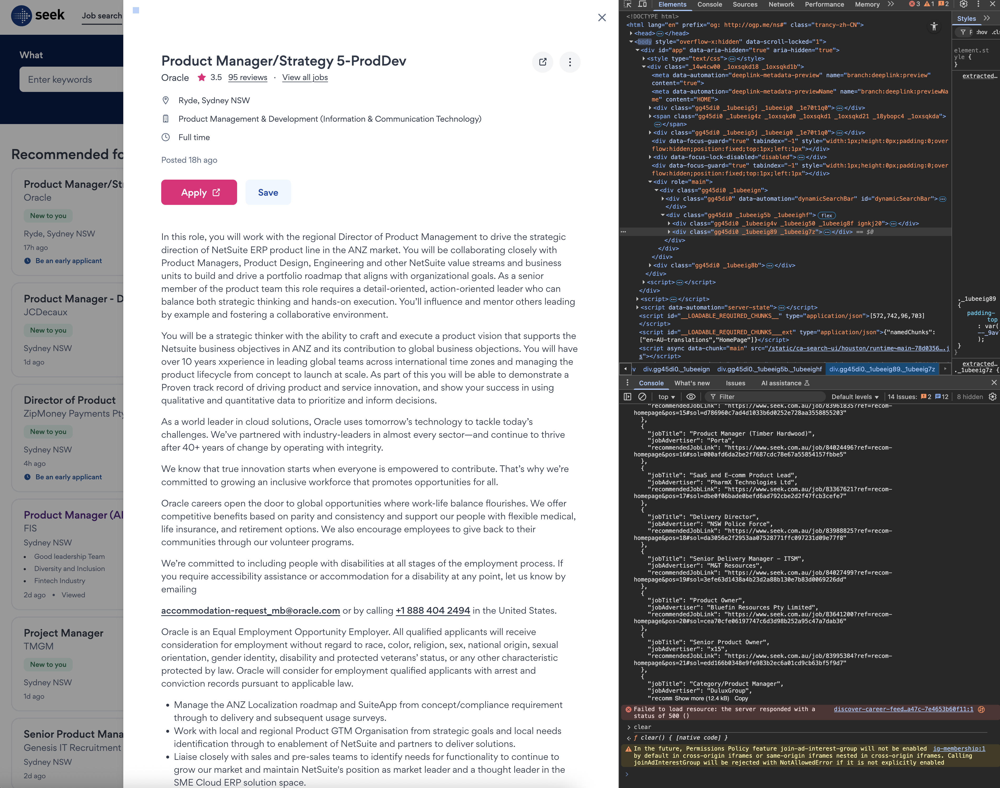

# 悉尼 SEEK 求职自动化：从爬取职位到智能生成 Cover Letter 的实践

## 背景
在下个月，也就是 6 月，我就要搬家到悉尼生活，因此最近我需要找一份在悉尼的工作。
了解了悉尼线上求职网站后，我找到了seek.com.au，seek 是澳洲最大的求职网站，
在我上传了简历信息后，我马上意识到他与中国求职网站的不同，其中最大的不同是，seek 上没有太多的中介，也就是说，seek 上的招聘信息都是直接来自雇主的，你需要自己去申请，而不像在国内你只要等着猎头找你就行。

## 自动化求职
在打开密密麻麻的招聘信息后，我马上意识到，我需要自动化这个求职过程，
整个流程非常简单：
- 在seek 的首页爬取招聘信息,获取job lists
- 通过python requests 库发送请求，获取job description
- 利用大模型分析job description，与我的简历进行匹配，对每个job进行打分
- 如果job 得分大于 80 分，就根据job description，和我的简历，生成一封求职信，同时这个过程中，我需要他参考how to write a cover letter.
- 最后生成targeted job list，逐个进行申请

## 实现

### get job list
```javascript
(function(){
   // 1. 在这里填写本次页面的 class 名称
   const classes = {
     card:              "gg45di0 _1ubeeig93 _1ubeeig7z _1ubeeigbb _1ubeeiga7 _1ubeeig5f w39xvk4 w39xvk5 w39xvk6",
     jobTitle:          "gg45di0",
     jobAdvertiser:     "gg45di0 _1ubeeig4z _1oxsqkd0 _1oxsqkd1 _1oxsqkd22 _18ybopc4 _1oxsqkda",
     recommendedJobLink:"gg45di0 gg45dif  gg45di0 gg45dif w39xvk9 _1ubeeig5j _1ubeeigj _1ubeeigk _1ubeeigl _1ubeeigm _1ubeeig7"
   };
 
   // 2. 将空格分隔的 class 转成 .class1.class2...
   function sel(cls){
     return "." + cls.trim().split(/\s+/).join(".");
   }
 
   // 3. 抓取所有卡片
   const cards = document.querySelectorAll(sel(classes.card));
 
   // 4. 提取数据并输出
   const data = Array.from(cards).map(card => ({
     jobTitle:          card.querySelector('[data-automation="jobTitle"]')?.innerText.trim() || "",
     jobAdvertiser:     card.querySelector(sel(classes.jobAdvertiser))?.innerText.trim() || "",
     recommendedJobLink:card.querySelector(sel(classes.recommendedJobLink))?.href || ""
   }));
 
   console.log(JSON.stringify(data, null, 2));
 })();
```


*职位列表爬取效果示意*

这里我没有使用firecrwal，是因为seek的招聘信息是动态加载的，并且需要登录态，所以我选择直接在浏览器中打开seek的首页，然后打开浏览器的开发者工具，然后在console中粘贴这段代码，然后回车，这样就能获取到job list了。

### get job description
```python
import json
import requests
from bs4 import BeautifulSoup
import os

# Determine project root and JSON data path
root_dir = os.path.abspath(os.path.join(os.path.dirname(__file__), '..'))
json_path = os.path.join(root_dir, 'job-data', 'job0504.json')

# Common headers to mimic browser
HEADERS = {
    'User-Agent': 'Mozilla/5.0 (Macintosh; Intel Mac OS X 10_15_7) '
                  'AppleWebKit/537.36 (KHTML, like Gecko) '
                  'Chrome/135.0.0.0 Safari/537.36',
    'Accept-Language': 'zh-CN,zh;q=0.9,en;q=0.8',
    'Referer': 'https://www.seek.com.au',
    'Origin': 'https://www.seek.com.au'
}

# Load job list
with open(json_path, 'r', encoding='utf-8') as f:
    jobs = json.load(f)

# Fetch and parse each job detail
for job in jobs:
    url = job.get('recommendedJobLink')
    try:
        resp = requests.get(url, headers=HEADERS, timeout=10)
        resp.raise_for_status()
    except Exception as e:
        print(f"Failed to fetch {url}: {e}")
        job['jobDetails'] = ''
        continue

    soup = BeautifulSoup(resp.text, 'html.parser')
    # Find the detail container by data-automation only
    detail_div = soup.find(attrs={ 'data-automation': 'jobAdDetails' })
    if detail_div:
        # extract inner text
        job['jobDetails'] = detail_div.get_text(separator='\n').strip()
    else:
        # fallback to JSON-LD description
        ld_script = soup.find('script', type='application/ld+json')
        if ld_script:
            try:
                ld = json.loads(ld_script.string)
                job['jobDetails'] = ld.get('description', '').strip()
            except:
                job['jobDetails'] = ''
        else:
            print(f"Detail section not found for {url}")
            job['jobDetails'] = ''

# Write updated data back to the same JSON file
with open(json_path, 'w', encoding='utf-8') as f:
    json.dump(jobs, f, ensure_ascii=False, indent=2)

print(f"Updated {len(jobs)} jobs with details.")
```
这里我使用python 的requests库，来获取job description，request 和 beautifulsoup4库来解析html，这样我们就获取了完整的job description。


*职位详情抓取示意*


*职位详情页面截图*

### match job description with resume
```python
import os
import json
import requests
import logging

# setup logging
logging.basicConfig(level=logging.INFO, format='%(message)s')

def load_json(path):
    with open(path, 'r', encoding='utf-8') as f:
        return json.load(f)

def save_json(path, data):
    with open(path, 'w', encoding='utf-8') as f:
        json.dump(data, f, ensure_ascii=False, indent=2)

# paths
dir_root = os.path.abspath(os.path.join(os.path.dirname(__file__), '..'))
path_jobs = os.path.join(dir_root, 'job-data', 'job0504.json')
path_target = os.path.join(dir_root, 'job-data', 'target_job.json')
path_cv = os.path.join(dir_root, 'personal_info', 'qiansui_cv.md')

# Load .env variables if file exists
dotenv_path = os.path.join(dir_root, '.env')
if os.path.exists(dotenv_path):
    with open(dotenv_path, 'r', encoding='utf-8') as df:
        for line in df:
            if line.strip() and not line.strip().startswith('#') and '=' in line:
                k, v = line.strip().split('=', 1)
                os.environ.setdefault(k, v)

# load data
jobs = load_json(path_jobs)
resume = open(path_cv, 'r', encoding='utf-8').read()
existing = []
if os.path.exists(path_target):
    # load existing matches if file is non-empty and valid JSON
    try:
        if os.path.getsize(path_target) > 0:
            existing = load_json(path_target)
    except (json.JSONDecodeError, OSError):
        existing = []

# prepare API
env_key = os.getenv('DASHSCOPE_API_KEY')
if not env_key:
    raise RuntimeError('DASHSCOPE_API_KEY not set. Please define it in .env or environment variables.')
headers = {
    'Content-Type': 'application/json',
    'Authorization': f'Bearer {env_key}'
}
url = 'https://dashscope.aliyuncs.com/compatible-mode/v1/chat/completions'

results = None
for job in jobs:
    prompt_sys = (
        f"You are a career matching assistant. Candidate resume:\n{resume}\n"
        "Evaluate the fit against the job description and output ONLY a JSON object with fields 'score' (integer 0-100) and 'evaluation' (≤200 characters summarizing key reasons)."
    )
    prompt_user = f"Job description:\n{job['jobDetails']}"
    body = {
        'model': 'qwen-plus-latest',
        'messages': [
            {'role': 'system', 'content': prompt_sys},
            {'role': 'user', 'content': prompt_user}
        ]
    }
    resp = requests.post(url, headers=headers, json=body, timeout=30)
    resp.raise_for_status()
    data = resp.json()
    # debug log full response
    logging.info(f"API response for {job['recommendedJobLink']}: {data}")
    # extract content from response: normalize data['output'] or top-level
    response_body = data.get('output', data)
    choices = response_body.get('choices', [])
    if not choices:
        logging.error(f"No choices in response for {job['recommendedJobLink']}: {data}")
        continue
    content = choices[0]['message']['content']
    # parse JSON response for score and evaluation
    try:
        result_json = json.loads(content)
        score = int(result_json.get('score', 0))
        evaluation = result_json.get('evaluation', '').strip()
    except Exception:
        # fallback: extract score from digits and preview evaluation
        import re
        m = re.search(r"(\d{1,3})", content)
        score = int(m.group(1)) if m else 0
        evaluation = content.strip().replace('\n', ' ')[:200]
    if score >= 80:
        entry = job.copy()
        entry['match_score'] = score
        entry['evaluation'] = evaluation
        # append immediately to target_job.json
        try:
            if os.path.exists(path_target) and os.path.getsize(path_target) > 0:
                existing_entries = load_json(path_target)
            else:
                existing_entries = []
        except:
            existing_entries = []
        existing_entries.append(entry)
        save_json(path_target, existing_entries)
        logging.info(f"Appended job '{job['jobTitle']}' with score {score} to {path_target}")
```
在这里，我使用qwen-plus-latest来匹配job description和resume，因为qwen-plus-latest是全部免费的，并且性能上也还不错，当然你也可以换成其他的模型。
同时在这里，我采用动态的提示词，也就是说我可以随时更新我的简历信息，保证匹配的准确性。


*职位与简历匹配打分示意*

### generate cover letter
```python
import os
import json
import requests


def load_file(path):
    with open(path, encoding="utf-8") as f:
        return f.read()


def main():
    # Paths
    script_dir = os.path.dirname(os.path.abspath(__file__))
    root_dir = os.path.abspath(os.path.join(script_dir, os.pardir))
    cv_path = os.path.join(root_dir, "personal_info", "qiansui_cv.md")
    prompt_path = os.path.join(script_dir, "coverletter-prompt.md")
    guide_path = os.path.join(root_dir, "doc", "How to write a career change cover letter (with examples).md")
    jobs_path = os.path.join(root_dir, "job-data", "target_job.json")
    output_dir = os.path.join(root_dir, "applying-job")
    os.makedirs(output_dir, exist_ok=True)

    # Load contents
    cv_content = load_file(cv_path)
    prompt_template = load_file(prompt_path)
    guide_content = load_file(guide_path)
    with open(jobs_path, encoding="utf-8") as f:
        jobs = json.load(f)

    # Init DashScope-compatible HTTP client
    api_key = os.getenv("DASHSCOPE_API_KEY")
    if not api_key:
        raise EnvironmentError("Please set DASHSCOPE_API_KEY in environment variables")
    headers = {
        'Content-Type': 'application/json',
        'Authorization': f'Bearer {api_key}'
    }
    url = 'https://dashscope.aliyuncs.com/compatible-mode/v1/chat/completions'

    for job in jobs:
        advertiser = job.get("jobAdvertiser", "company").replace("/", "_")
        filename = f"(saved){advertiser}.md"
        out_path = os.path.join(output_dir, filename)

        job_details = job.get("jobDetails", "")
        # Assemble prompt
        prompt = (f"{prompt_template}\n\n"
                  f"{guide_content}\n\n"
                  f"工作信息:\n{job_details}\n\n"
                  f"简历信息:\n{cv_content}")

        # Generate cover letter via HTTP
        body = {
            'model': 'qwen-plus',
            'messages': [
                {'role': 'system', 'content': 'You are an expert in writing cover letters. Based on the given user information and job requirements, you need to write a cover letter that can help the user get an interview opportunity. The cover letter should be personalized and tailored to the user\'s strengths and the job requirements.'},
                {'role': 'user', 'content': prompt}
            ],
            'temperature': 0.7
        }
        resp = requests.post(url, headers=headers, json=body, timeout=30)
        resp.raise_for_status()
        data = resp.json()
        response_body = data.get('output', data)
        choices = response_body.get('choices', [])
        cover_text = choices[0]['message']['content'] if choices else ''

        # Write output file
        with open(out_path, "w", encoding="utf-8") as fout:
            fout.write(f"# {advertiser}\n\n")
            fout.write("statuts:\n- saved\n- waiting\n- interviewing\n- done\n\n")
            fout.write("## info\n")
            fout.write(json.dumps(job, ensure_ascii=False, indent=4))
            fout.write("\n\n## status:\n\n## coverletter:\n")
            fout.write(cover_text)
        print(f"Wrote cover letter to {out_path}")


if __name__ == "__main__":
    main()
```
最后，我使用qwen-plus来生成cover letter，同样，我采用动态的提示词，其中简历和 how to write a cover letter (从seek 官方网站上下载的) 都是动态的，保证cover letter更加符合澳洲的求职习惯。


*自动生成求职信结果示意*


## 总结

通过这套自动化流程，我不仅极大地节省了筛选和申请职位的时间，还能确保每一封求职信都更加个性化、针对性强。虽然在实际操作中，部分企业会有额外的个性化问题需要手动填写，或者使用自有招聘系统无法直接批量申请，但整体流程已经大大降低了重复性劳动的负担。

对于像我一样希望在澳洲找工作的朋友，尤其是技术背景的同学，强烈建议尝试用自动化和 AI 工具武装自己。即使你不是程序员，也可以考虑和身边的技术朋友合作，打造适合自己的自动化求职助手。

未来我还计划进一步优化脚本，比如自动检测职位变化、自动提醒面试进度等。如果你对这个话题感兴趣，欢迎留言交流，或者一起探讨更多自动化求职的可能性！

希望这篇文章能为你的求职之路带来一些启发和帮助。祝大家都能顺利拿到心仪的 offer！

**感谢阅读！如果有任何问题或建议，欢迎在评论区留言交流。**