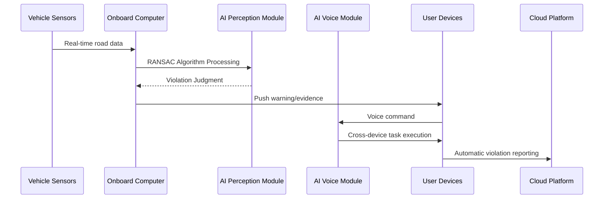

# Car Intelligent Cockpit
**Product Leader**  
- **Visual Perception-Based Identification of Traffic Violations:** Developed a combined software and hardware product: identify illegal lane change by RANSAC Algorithm; records traffic violations by vehicle-mounted camera; automatically generate violation reports for vehicle owners to submitted to transportation authorities at one click.
- **AI Voice Assistance for In-Vehicle Office Work:** Provided a seamless cross-device in-transit working experience by integrating office software suites on smartphone, in-vehicle display and laptops. Realized intelligent generation of work information summaries, email replies, and to-do processing, etc., through voice control.

## Product Idea (Why)
With the acceleration of automotive intelligence, drivers face two core demands:  
1. **Safety Needs**: 80% of traffic accidents are caused by illegal driving behaviors, requiring real-time detection and intervention  
2. **Efficiency Needs**: Average commute time reaches 52 minutes/day, creating demand for efficient in-vehicle office scenarios  

Traditional solutions rely on fragmented hardware devices with poor software integration. Our intelligent cockpit achieves hardware-software synergy through three-layer innovation.

## Product Features (What)
| Core Feature | Technical Solution | Customer Value |
|--------------|--------------------|----------------|
| Visual Perception Safety System | RANSAC Algorithm + Multi-camera fusion | Reduces 40% traffic violations |
| Cross-device Voice Office Suite | NLP + Knowledge Graph + Device Link | Increases 25% work efficiency |
| Intelligent Cockpit Platform | SOA Architecture + OTA Updates | Enables continuous feature iteration |

## Product Architecture (How)

Key Architecture Components:
1. **Edge Computing Layer**: Vehicle-mounted cameras/radars
2. **AI Decision Layer**: Dual-core algorithms (safety + office)
3. **Service Integration Layer**: Seamless connection with government/enterprise systems

