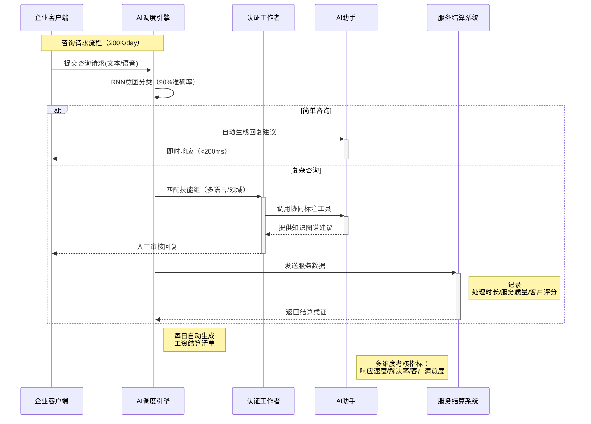
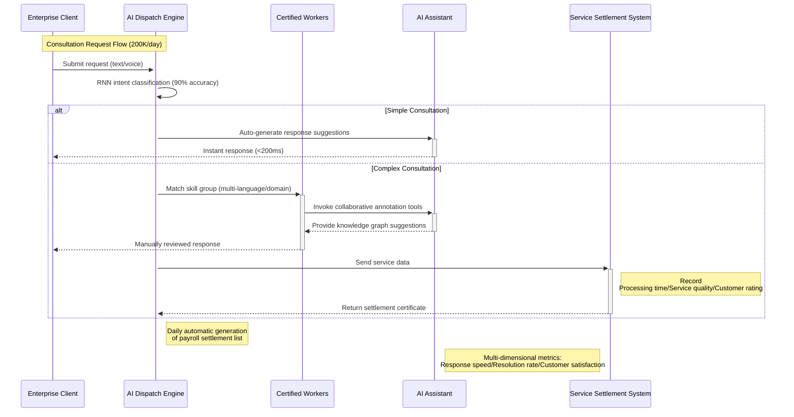

### AI-Hybrid Service Desk
**Product Expert**  
- **Crowdsourcing Mode:** Utilized a social crowdsourcing model to automatically allocate 200K daily manual consultations to the public, reducing enterprise costs by 2M monthly.
- **AI-based Intent Classification Algorithm:** Categorized 200,000 daily manual consultations by RNN intent identification algorithm, accurately distributing them to appropriate skill groups with 90% precision.
- **Social Impact:** Provided employment opportunities for over 110,000 people with disabilities.

tips:AI-Hybrid Service Desk 是一款目前已经上线的商业化产品，如果你有购买的需求，请点击这里：https://www.lydaas.com/quickservice
tips:AI-Hybrid Service Desk is a commercially available product. For purchasing inquiries, click here: https://www.lydaas.com/quickservice

### Idea | 创新理念
`社会价值驱动的技术普惠`  
通过AI+众包模式赋能企业电商服务：  
- 解决企业在在大促等服务高峰期间的高成本，且无法找到足够服务资源问题。  
- 为残障人士提供就业机会，创造更多社会价值。
- 企业在线发布服务需求订单，服务人员随时承接，并在预约时间内进行服务接待，灵活就业

### 产品特性 | Key Features
**智能动态路由**  
- 精准识别服务诉求，基于RNN的实时意图识别
- 快速服务分配，多维度技能组匹配（语言/领域/复杂度）  
**社会协作网络**  
- 云客服弹性工作者数字认证系统
- uber式服务分发与社会化接单模式
**ai在线服务**
- 无障碍产品设计，辅助残障人士更好服务接待
- AI-HUman 人机辅助型服务接待，提升服务效率，提升服务满意度

### 产品应用场景
ai在线客服工作台适用于多种服务场景，文中只进行简单举例，企业可根据自身业务特性灵活配置应用。
1. 在线售前接待
企业可在零售渠道部署在线会话入口，顾客通过服务入口进行在线咨询。客服在客服工作台接收到顾客咨询后可结合顾客信息、商品信息等对顾客咨询给出答复
2. 售前热线咨询
企业可在官网等阵地提供联系电话，在客服工作台配置呼入流程。顾客拨打固定号码后，按照配置的流程将顾客热线电话流入工作台分配给不同的销售接听。销售在工作台与顾客进线沟通，过程中将客户的信息与意向进行单独记录
3. 售后服务请求
对于已购买的顾客，企业可在订单页面放置服务入口，顾客点击联系企业后，自动实现顾客历史订单信息带入客服工作台。客服在收到顾客服务请求后，在客服工作台进行服务处理
对于顾客的离线服务场景，例如退换货，退款，开发票等，可嵌入工单提交入口，顾客填写相关信息后创建工单，客服在确认工单信息后进行处理，实现顾客的售后服务请求
4. 顾客主动服务
可根据历史服务记录获取顾客服务评价，对评价不满意顾客主动发起外呼，进行主动服务

### 产品设计 | System Design
**架构拓扑**  

### Idea | Innovation Concept
`Technology Driven by Social Value`  
Empowering enterprise e-commerce services through AI + crowdsourcing model:  
- Solve enterprises' high costs during peak service periods like promotions, and inability to find sufficient service resources  
- Provide employment opportunities for people with disabilities, creating more social value  
- Enterprises publish service demand orders online, service providers can accept orders anytime and provide services within scheduled time, enabling flexible employment

### Product Features | Key Features
**Intelligent Dynamic Routing**  
- Accurately identify service demands with RNN-based real-time intent recognition 
- Rapid service allocation with multi-dimensional skill group matching (language/domain/complexity)  

**Social Collaboration Network**  
- Digital certification system for cloud-based flexible customer service workers  
- Uber-style service distribution and socialized order acceptance model  

**AI Online Service**  
- Barrier-free product design to assist people with disabilities in better service
- AI-Human collaborative service接待, improving service efficiency and satisfaction

### Application Scenarios
The AI online customer service workstation applies to various service scenarios. This document provides simple examples; enterprises can configure flexibly based on their business characteristics.

1. **Online Pre-sales**  
Enterprises can deploy online chat portals in retail channels. Customers make inquiries through these portals. Customer service representatives respond using customer information and product details in the workstation.

2. **Pre-sales Hotline Consultation**  
Enterprises provide contact numbers on official websites. Configure call routing in the workstation. Customer calls are routed to different sales representatives based on configured workflows. Sales record customer information and intentions during communication.

3. **After-sales Service Requests**  
For existing customers, enterprises can place service portals on order pages. Historical order information is automatically loaded into the workstation when customers contact support.  
For offline scenarios like returns/refunds/invoicing: Embed ticket submission portals. Customers create tickets by submitting information, which customer service processes after verification.

4. **Proactive Customer Service**  
Initiate outbound calls to dissatisfied customers based on historical service evaluations for proactive service recovery.

### System Design
**Architecture Topology**  

