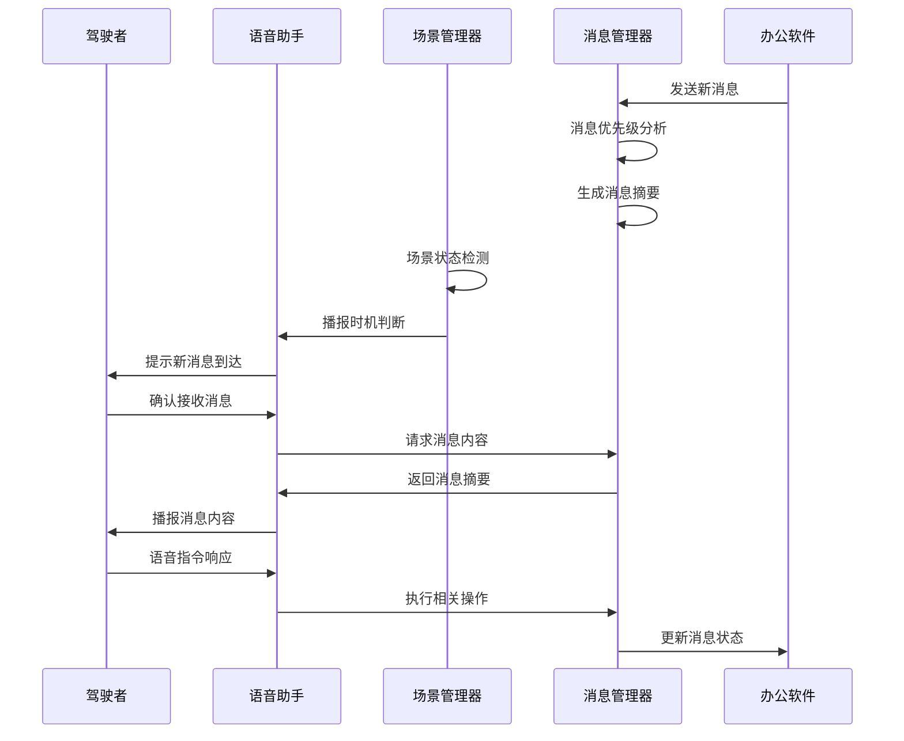
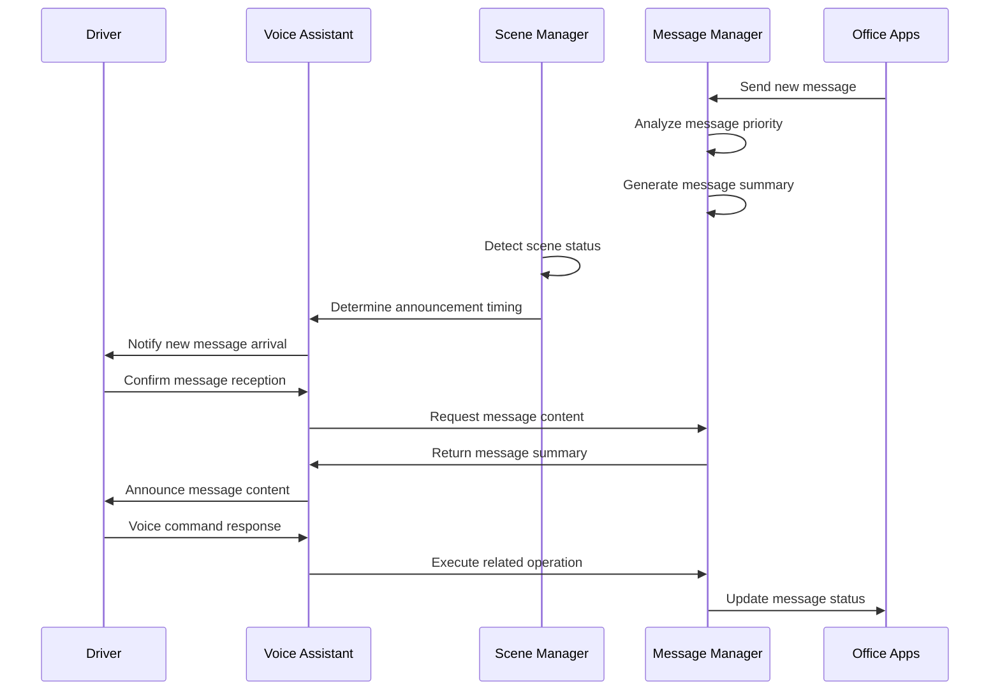
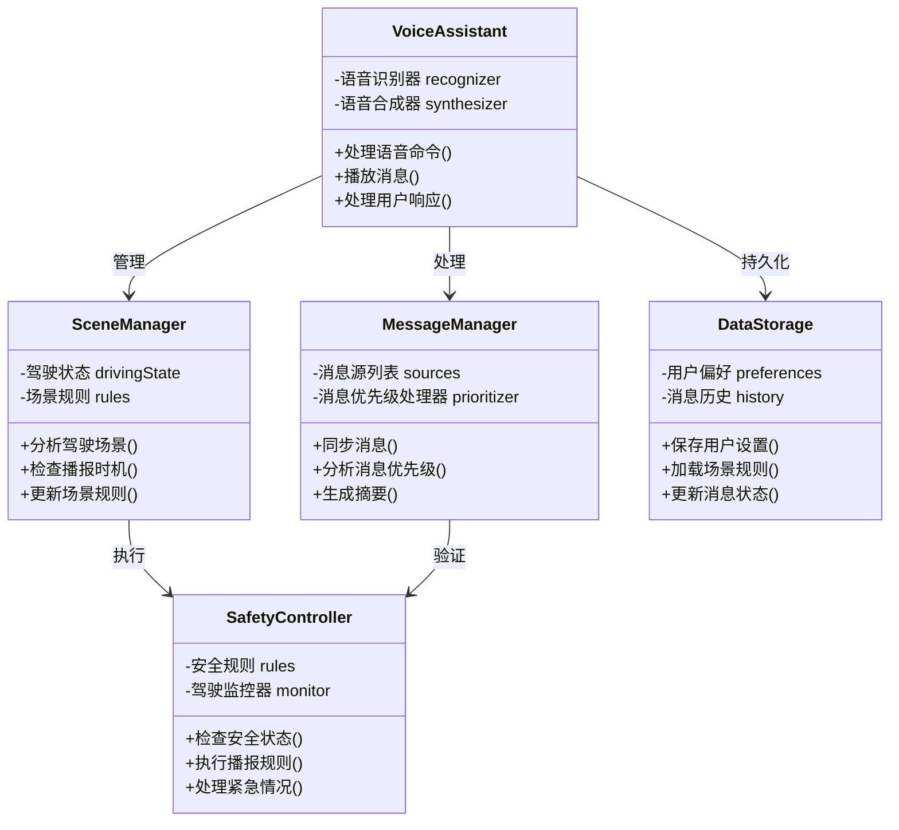
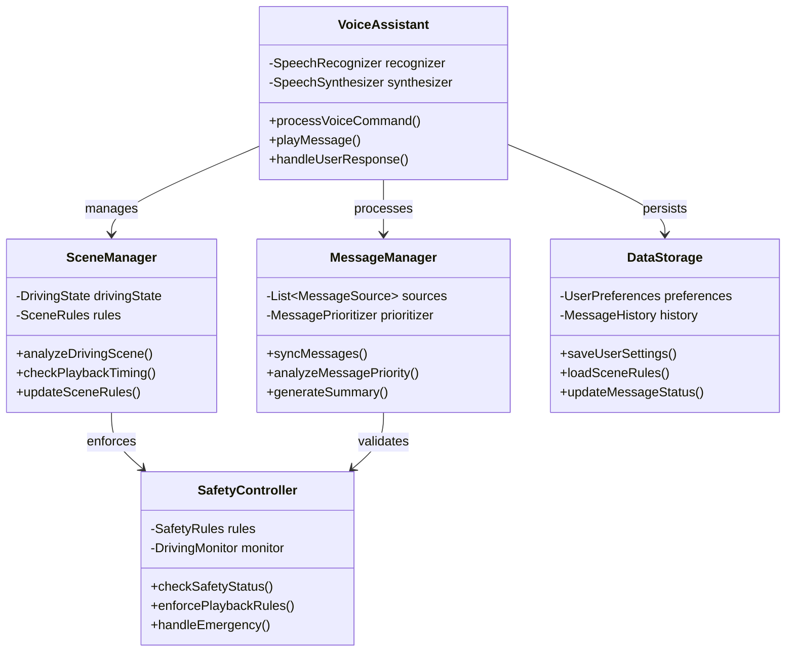
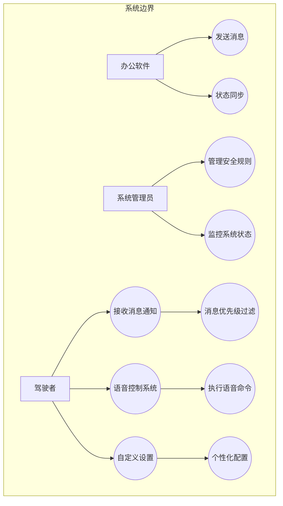
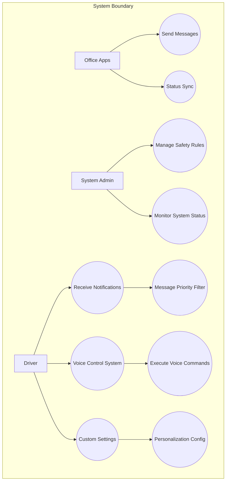

# 智能车载办公助手设计方案
# Intelligent In-Vehicle Office Assistant Design
Slogan Options:
1. "Drive Smart, Achieve More."
2. "Safety on the Road, Success at life."
3. "Navigate with Intelligence, Execute with Precision."
4. "Empower Your Commute, Elevate Your Productivity."
5. "Smart Drive, Smarter Business."

## 1. 产品背景与设计原因
## 1. Product Background and Design Rationale

### 1.1 背景分析
### 1.1 Background Analysis

当前社会工作节奏加快，很多人需要在通勤时间处理工作事务。驾驶过程中无法直接查看手机或其他设备的工作消息。车载系统与办公软件的集成度不足，缺乏智能化的消息处理机制。安全驾驶与工作效率之间存在矛盾。

The pace of work in modern society is accelerating, with many people needing to handle work matters during their commute. While driving, they cannot directly check work messages on phones or other devices. Current vehicle systems lack sufficient integration with office software and intelligent message processing mechanisms. There exists a fundamental conflict between safe driving and work efficiency.

### 1.2 设计原因
### 1.2 Design Rationale

提供安全的驾驶时工作消息处理方案。利用AI技术智能判断消息重要性和播报时机。减少驾驶者工作焦虑，提升通勤时间利用率。确保驾驶安全的前提下提供必要的工作信息获取渠道。

To address these challenges, we aim to provide a safe solution for handling work messages while driving. By leveraging AI technology, we can intelligently assess message importance and determine optimal announcement timing. This approach helps reduce driver work anxiety and improve commuting time utilization, while ensuring access to necessary work information without compromising driving safety.

## 2. 产品描述与特性

### 2.1 核心功能
### 2.1 Core Features

1. 智能消息集成：集成钉钉、邮件等多个工作软件的消息。实时消息同步和优先级分析。智能消息摘要生成。

1. Intelligent Message Integration: The system integrates messages from multiple work applications including DingTalk and email, providing real-time message synchronization with priority analysis and intelligent message summary generation.

2. 场景感知：基于车速、路况等判断适合的播报时机。根据驾驶行为动态调整交互方式。支持自定义场景规则。

2. Scene Awareness: The system determines appropriate announcement timing based on vehicle speed and road conditions, dynamically adjusts interaction methods according to driving behavior, and supports customized scene rules.

3. 语音交互：自然语言理解和语音控制。智能语音播报和对话。语音指令处理工作事务。

3. Voice Interaction: Features natural language understanding and voice control capabilities, intelligent voice announcements and dialogue, and the ability to process work matters through voice commands.

4. 安全管控：驾驶安全状态监测。消息优先级过滤。紧急情况智能处理。

4. Safety Control: Implements driving safety status monitoring, message priority filtering, and intelligent handling of emergency situations.

### 2.2 目标用户
### 2.2 Target Users

主要用户是经常需要在通勤时间处理工作事务的职场人士。次要用户包括需要及时了解重要工作信息的管理人员。潜在用户是对提升通勤时间利用率有需求的驾驶者。

The primary users are professionals who frequently need to handle work matters during their commute. Secondary users include managers who need to stay updated with important work information. Potential users are drivers who seek to improve their commuting time utilization.

### 2.3 价值主张
### 2.3 Value Proposition

安全性是我们的首要考虑，确保在驾驶安全的前提下处理工作事务。通过提升通勤时间利用率来提高效率，减少工作延误。系统提供智能化的消息处理和语音交互，确保便捷性。根据用户习惯和场景进行自适应调整，实现个性化体验。

Safety is our primary consideration, ensuring work matters are handled while maintaining driving safety. The system improves efficiency by enhancing commuting time utilization and reducing work delays. It provides convenience through intelligent message processing and voice interaction. The experience is personalized through adaptive adjustments based on user habits and scenarios.

## 3. 产品流程

### 3.1 流程简介
### 3.1 Process Overview

1. 系统初始化：进行用户身份认证，完成工作软件授权连接，加载场景规则。

1. System Initialization: Performs user authentication, completes work software authorization and connection, and loads scene rules.

2. 消息处理流程：实现实时消息接收和同步，进行消息优先级分析，生成内容智能摘要，判断场景适应性，作出语音播报决策。

2. Message Processing Flow: Implements real-time message reception and synchronization, conducts message priority analysis, generates intelligent content summaries, assesses scene adaptability, and makes voice announcement decisions.

3. 交互流程：包括语音指令识别，消息内容播报，用户反馈处理，以及任务执行确认。

3. Interaction Process: Includes voice command recognition, message content announcement, user feedback processing, and task execution confirmation.

### 3.2 时序图
### 3.2 Sequence Diagram

中文版本 (Chinese Version):

English Version:

## 4. 产品架构

### 4.1 架构简介
### 4.1 Architecture Overview

系统采用模块化设计，主要包含以下核心组件：语音交互模块负责处理语音识别和合成；场景管理模块负责分析驾驶场景和状态；消息管理模块处理各类消息的接收和处理；安全控制模块确保系统运行安全；数据存储模块管理用户配置和历史数据。

The system adopts a modular design with the following core components: The Voice Interaction Module handles speech recognition and synthesis; the Scene Management Module analyzes driving scenes and states; the Message Management Module handles reception and processing of various messages; the Safety Control Module ensures system operation safety; and the Data Storage Module manages user configurations and historical data.

### 4.2 类图
### 4.2 Class Diagram

中文版本 (Chinese Version):

English Version:

## 5. 产品功能说明

### 5.1 用例图
### 5.1 Use Case Diagram

中文版本 (Chinese Version):

English Version:

### 5.2 功能清单
### 5.2 Feature List

#### 驾驶者功能
#### Driver Features

1. 消息接收：系统支持接收新消息通知，通过语音播报消息内容，并提供快速响应处理机制。

1. Message Reception: The system supports receiving new message notifications, announces message content through voice, and provides quick response processing mechanisms.

2. 系统控制：提供语音命令控制功能，允许调整播报设置，支持紧急模式切换。

2. System Control: Provides voice command control functionality, allows adjustment of announcement settings, and supports emergency mode switching.

3. 个性化设置：允许自定义消息优先级规则，设置场景播报偏好，选择语音交互方式。

3. Personalization Settings: Allows customization of message priority rules, setting of scene announcement preferences, and selection of voice interaction methods.

#### 系统管理员功能
#### System Administrator Features

1. 安全管理：负责设置安全规则，监控系统状态，处理异常情况。

1. Safety Management: Responsible for setting safety rules, monitoring system status, and handling abnormal situations.

2. 系统维护：进行系统配置更新，管理用户权限，优化系统性能。

2. System Maintenance: Performs system configuration updates, manages user permissions, and optimizes system performance.

#### 办公软件接入功能
#### Office Software Integration Features

1. 消息推送：支持发送工作消息，更新消息状态，接收用户反馈。

1. Message Push: Supports sending work messages, updating message status, and receiving user feedback.

2. 状态同步：实现消息状态同步，更新处理结果，维护连接状态。

2. Status Synchronization: Implements message status synchronization, updates processing results, and maintains connection status.

