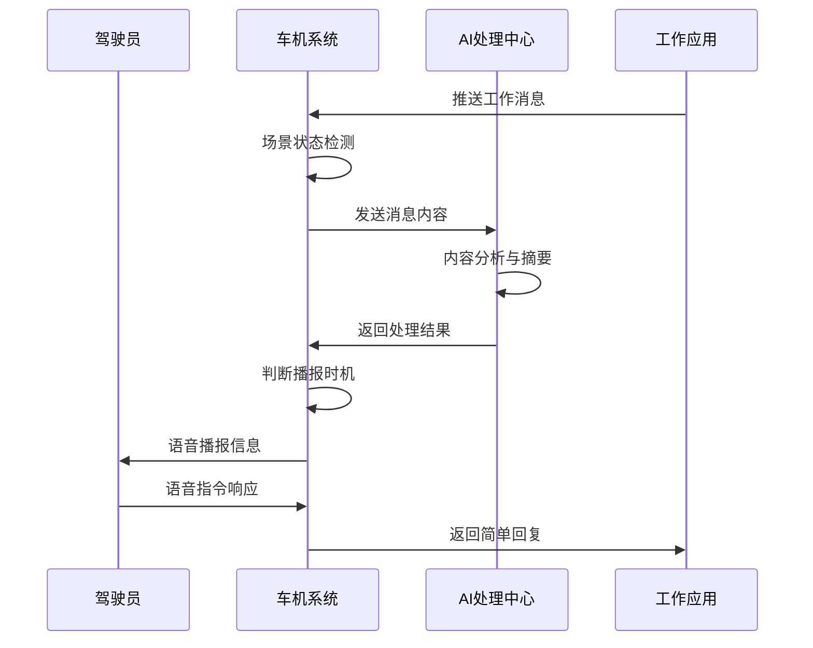
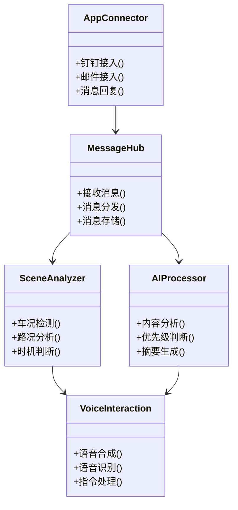
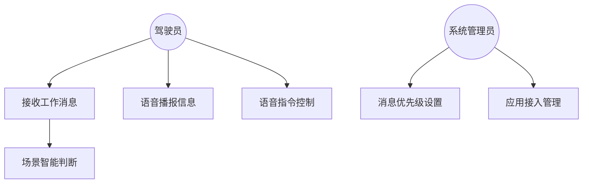

# 智能车机办公助手设计方案

## 产品背景与设计原因

在当今快节奏的社会中，很多人需要在通勤或商务出行期间处理工作事务。然而，驾驶过程中直接查看和处理工作消息存在安全隐患。为了解决这一痛点，我们设计了智能车机办公助手，它能够：

1. 智能感知驾驶场景，在合适的时机处理工作信息
2. 通过语音交互方式，降低驾驶分心风险
3. 利用AI技术，智能总结和过滤信息，提供重要工作内容概要

## 产品描述与特性

### 核心功能
- 多源工作消息接入（钉钉、邮件等）
- 智能场景识别与消息推送时机判断
- AI消息内容智能分析与摘要
- 语音交互与信息播报
- 紧急工作事项提醒

### 目标客户
- 商务人士和企业管理者
- 需要在通勤过程中及时了解工作信息的职场人士
- 经常进行商务出行的销售人员

### 解决问题
- 降低驾驶期间查看工作消息的安全风险
- 提高工作信息获取效率
- 减少错过重要工作信息的可能性

## 产品流程

### 流程简介
1. 消息接收：系统实时接收各类工作软件的消息
2. 场景判断：基于车辆状态、路况等信息判断是否适合播报
3. 内容处理：AI分析消息内容，生成简洁摘要
4. 交互推送：通过语音方式播报重要信息
5. 用户反馈：支持语音指令进行简单回复

### 流程图示

## 产品架构

### 架构简介
系统采用模块化设计，包含消息接入、场景识别、AI处理、语音交互等核心模块。

### 架构图示

## 产品功能说明

### 用例图

### 功能清单

#### 驾驶员角色
1. 消息接收与播报
   - 自动接收各类工作消息
   - 智能场景下的语音播报
   - 消息重要程度提示

2. 语音交互
   - 语音命令控制
   - 简单消息回复
   - 消息重播请求

#### 管理员角色
1. 系统配置
   - 应用接入管理
   - 消息优先级规则设置
   - 场景判断规则配置

2. 运维管理
   - 系统监控
   - 用户反馈处理
   - 系统优化调整
